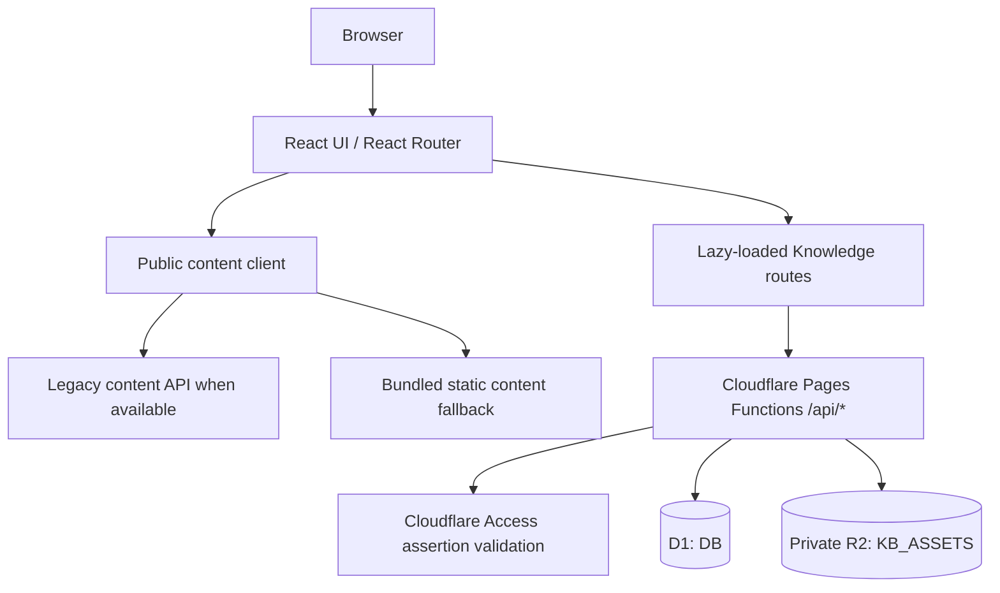

# Architecture Overview

## Product shape

The release candidate is a React/Vite application served by Cloudflare Pages.
React Router keeps the public blog routes in the initial application shell and
lazy-loads the Knowledge overview, list, and editor routes. This keeps Tiptap
and knowledge editing dependencies out of the public blog's initial bundle.

## Frontend

- **React + Vite** provide the application shell and production build.
- **React Router** maps public blog routes and Knowledge routes.
- **Lazy loading** applies to `/knowledge`, `/knowledge/notes`, and editor
  routes. The public home, posts, and search routes do not load Tiptap on
  initial visit.
- **Tiptap** powers the existing knowledge editor. Its schema and stored
  `content_json` format are unchanged.
- The public content client uses `VITE_API_BASE_URL` (default `/api/v1`) and
  has a bundled static-content fallback for the blog.

## Backend and storage

- **Cloudflare Pages Functions** implement the existing `/api/notes`,
  `/api/search`, `/api/stats`, and `/api/assets` boundaries.
- **D1**, bound as `DB`, stores Note records, versions, and the existing asset
  metadata used by those APIs.
- **R2**, bound as private `KB_ASSETS`, stores uploaded asset bytes. Downloads
  are proxied through the existing API; the application does not expose public
  R2 URLs.

## API and authentication boundary

`functions/_middleware.ts` applies the current Cloudflare Access verification
to every `/api/*` request. The SPA has no client-side login state or page
guard. Consequently, non-API routes can render their shell, while knowledge
data, mutations, versions, and asset operations require a valid Access
assertion in deployed environments. Local `pages:dev` may use the explicit
local-only bypass described in the deployment documentation.

## Persistence boundaries

The existing note APIs own create, update, archive/restore, and explicit
version creation. Autosave continues to use the existing update path and its
current debounce and stale-response protections. Asset upload, download, and
delete exist, but no persistent note-to-asset relationship or Tiptap asset
reference is present.
