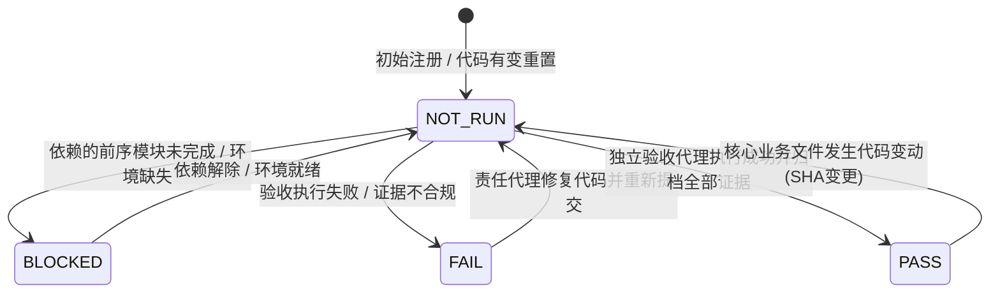

# 博客与知识库重构：独立验收规格与测试矩阵规范 (Acceptance Specification & Test Matrix)

- **版本**: v1.0.0
- **日期**: 2026-10-01
- **角色**: 独立验收设计代理 (Role Q)
- **基线约束**: `docs/codex-master-spec.md`, `docs/gemini-multi-agent-execution-plan-2026-10-01.md`
- **状态**: 规范已确立 (Draft Freeze Candidate for Wave 1 Gate G1)
- **执行原则**: 独立推导、全链路可观察、禁止自验自批、真实环境证据闭环

---

## 目录

1. [第一部分：用户旅程到验收用例的独立推导原则](#第一部分用户旅程到验收用例的独立推导原则)
   - 1.1 独立推导基本哲学
   - 1.2 真实角色模型与行为链路
   - 1.3 验收用例结构与要素规范
   - 1.4 验证环境分级与效力标准
   - 1.5 证据凭据防伪与证据链闭环
   - 1.6 禁止自验自批与独立审查铁律
2. [第二部分：全量验收测试矩阵 (24 项核心用例)](#第二部分全量验收测试矩阵)
   - [导航与上下文恢复 (NAV-01 ~ NAV-04)](#导航与上下文恢复)
   - [文章管理与列表交互 (LIST-01 ~ LIST-04)](#文章管理与列表交互)
   - [编辑工作台与状态保护 (EDIT-01 ~ EDIT-04)](#编辑工作台与状态保护)
   - [草稿发布与版本生命周期 (PUB-01 ~ PUB-04)](#草稿发布与版本生命周期)
   - [版本历史与回退安全性 (VER-01 ~ VER-02)](#版本历史与回退安全性)
   - [批量导入与媒体容灾 (IMP-01, ASSET-01)](#批量导入与媒体容灾)
   - [数据迁移与基线兼容 (DATA-01)](#数据迁移与基线兼容)
   - [安全边界与访问控制 (AUTH-01)](#安全边界与访问控制)
   - [响应式与无障碍标准 (UI-01 ~ UI-02)](#响应式与无障碍标准)
3. [第三部分：执行状态标记体系与门禁标准](#第三部分执行状态标记体系与门禁标准)
   - 3.1 状态枚举定义与转换约束
   - 3.2 证据凭据清单规范 (Evidence Manifest)
   - 3.3 门禁关卡 (Gate G0 ~ G4) 出口检查协议
   - 3.4 审查责任人签署机制

---

## 第一部分：用户旅程到验收用例的独立推导原则

### 1.1 独立推导基本哲学

验收规格的设计必须完全站在**外部真实用户与读者**的视角进行逆向推导，绝不屈从于任何内部代码实现细节：
1. **黑盒可观察性**: 严禁将“内部函数 `handleSave()` 被调用一次”、“某个 React Hook 执行了 `setState`”作为验收通过的标准。必须以**可观察的界面文本、URL 参数、HTTP 状态码、网络响应 Envelope、D1 数据库持久化状态、DOM 节点无障碍属性**作为唯一合法断言依据。
2. **完整行为闭环**: 用户旅程不能切碎为孤立动作。从“发起搜索 -> 翻页 -> 进入阅读 -> 连续翻篇 -> 点击返回”是一个连贯的上下文链条，验收用例必须覆盖全链路状态的传递、保存与恢复。
3. **防御性异常推导**: 不仅验收“阳光大道 (Happy Path)”，更要严格验收“网络中断、服务 500、并发双击、格式损坏、恶意提权”等极端场景下的系统容灾与自我保护能力。

### 1.2 真实角色模型与行为链路

系统定义三大真实角色，所有用例均从其核心诉求出发：
- **读者 (Reader)**: 浏览前台博客、搜索技术主题、阅读文章正文、点击目录跳转、上下翻页阅读、返回原始检索结果。核心期望：**阅读流畅、上下文不丢失、不看到未发布的草稿内容、无视口横向溢出**。
- **作者/管理员 (Author / Admin)**: 在私有后台管理文章、撰写草稿、高频输入、修改标签/分类、撤回/发布文章、恢复历史快照、批量导入 Markdown、上传附件。核心期望：**正文绝对不丢、并发无覆盖、操作即时反馈、发布版本与草稿严格隔离**。
- **系统审计/运维者 (Operator / Auditor)**: 验证 Cloudflare Access 鉴权边界、检查 D1 数据库版本迁移一致性、审查静态资源 R2 隔离性。核心期望：**未授权请求 100% 阻断、数据迁移零丢失、审计日志透明**。

### 1.3 验收用例结构与要素规范

每个验收用例均严格包含以下八大规范字段，缺少任一要素即视为无效用例：
1. **用例编号 (Case ID)**: 格式为 `[DOMAIN]-[NN]`，严格与架构方案编号对齐。
2. **用户旅程与目标 (User Journey & Objective)**: 用通俗业务语言描述用户意图与场景。
3. **前置数据条件 (Preconditions)**: 包含数据库初始化数据、URL 参数、Cookie/Session、视口宽度等。
4. **实际操作步骤 (Action Steps)**: 模拟用户键鼠操作、网络状态切换或 HTTP 调用的详细连续动作。
5. **预期可观察结果 (Expected Observable Results)**: 包含用户可见 UI 变化、网络交互、状态保持等精确断言。
6. **验证环境分级 (Verification Environment)**: 明确指定本用例必须执行的环境等级。
7. **证据交付标准 (Evidence Standards)**: 明确要求留存的日志、HTTP 报文、截图与退出码。
8. **缺陷严重度与阻断规则 (Severity & Blocker Level)**: 划分为 Block-Stopper (阻塞 G 关卡)、Critical (必须修复)、Major (功能缺陷)、Minor (体验瑕疵)。

### 1.4 验证环境分级与效力标准

为杜绝“在纯内存 Mock 中跑过就声称功能完备”的虚假安全感，建立四级验证环境效力矩阵：

| 环境等级 | 代号 | 运行载体 | 证明能力与局限性 | 门禁效力 |
| :--- | :--- | :--- | :--- | :--- |
| **L1: 单元组件测试** | `ENV-UNIT` | Vitest + jsdom + 组件 Props Mock | 证明单个组件渲染分支与受控回调正确；**无法证明路由/状态持久化/真实网络** | 仅作为代码提交基线，不可作为验收结项依据 |
| **L2: 客户端集成测试** | `ENV-INTEG` | Vitest + MemoryRouter + Mock Fetch | 证明前端多页面跳转、路由参数解析、防抖计时器逻辑；**无法证明 D1/Functions 契约** | 允许作为 Wave 2 部分中间交付物的临时参考 |
| **L3: 真实本地全栈** | `ENV-LOCAL-FULL` | `wrangler pages dev` + 真实本地 D1 (`--local`) + 本地 R2 | 证明前端通过真实的 HTTP 调用本地 Cloudflare Functions，执行真实 SQL 事务并返回真实 D1 响应 | **Wave 3 / Wave 4 必须达到的核心验收门槛** |
| **L4: 真实浏览器 E2E** | `ENV-BROWSER` | Playwright / Chromium (多视口无头/有头) + 本地全栈 | 证明真实浏览器的滚动位置恢复、焦点回跳、输入竞态、离开拦截及无障碍渲染 | **Wave 4 终审 Gate G4 必须执行的最终证据** |

> [!IMPORTANT]
> **绝对准则**: 纯内存 Mock (L1/L2) 的执行结果严禁填写为系统级验收通过！涉及数据持久化、快照隔离、发布生命周期的测试用例，必须在 L3 或 L4 环境下取得完整证据。

### 1.5 证据凭据防伪与证据链闭环

所有验收结论必须遵循“无证据即未执行”原则：
1. **证据归档路径**: 验收产物统一保存在 `.codex/evidence/<CASE-ID>/` 目录下。
2. **终端执行输出**: 必须包含执行命令、时间戳、环境变量、Git Commit SHA、命令退出码 (`exit 0`)。
3. **HTTP 报文凭据**: 记录关键网络请求的 URL、Method、Headers、Request Payload、Response Status Code、Response Body (包含标准 `{ success, data, error }` Envelope)。
4. **视觉截图凭据**: UI 与布局类用例必须在指定视口分辨率（1440px / 1024px / 390px / 320px）下抓取 PNG 截图，命名为 `<CASE-ID>_<VIEWPORT>_<STATE>.png`。

### 1.6 禁止自验自批与独立审查铁律

根据多代理执行方案的宪法性约束：
1. **职责严格隔离**: 
   - 编码实现代理（Role B, N, M, E）**严禁**为自己所编写的功能签发最终验收合格证。
   - 独立验收设计代理（Role Q）负责制定本规格与测试矩阵，审查各方实现是否符合产品定义。
   - 独立审查代理（Role R）负责代码质量与数据安全红线审查。
   - 独立浏览器验收代理（Role V）负责在最终候选集成基线（CANDIDATE_SHA）上执行真实的浏览器交互验收。
2. **熔断否决权**: 任何一条用例只要在 L3/L4 出现非预期结果或证据伪造，Role Q 与 Role R 有权立即中止当前集成流程，将任务状态打回 `NEEDS_REVIEW` 或 `BLOCKED`，由主控 Role C 分派回原负责代理整改。

---

## 第二部分：全量验收测试矩阵

### 导航与上下文恢复

#### NAV-01: 搜索第 2 页打开文章再返回，上下文与滚动位置精准恢复
- **用例编号**: `NAV-01`
- **用户旅程**: 读者在前台通过关键词搜索文章，翻至第 2 页浏览，点击进入其中一篇技术文章详细研读；阅读完毕后，读者点击页面顶部或底部的“返回”按钮，期望无缝回到第 2 页的检索列表，原搜索关键词、筛选分类、第 2 页分页状态以及在列表中的垂直滚动位置均完好保留，无需读者重新搜索或重新滚动寻找。
- **前置数据条件**:
  - 本地 D1 数据库中至少存在 25 篇已发布的文章，均包含标签与分类。
  - 搜索关键词（如 `“系统”`）在数据库中命中至少 15 篇，列表分页大小设为每页 10 篇（产生第 1 页与第 2 页）。
- **实际输入/操作步骤**:
  1. 浏览器打开前台首页，点击导航“搜索”，进入 `/search`。
  2. 在搜索框输入 `系统`，点击搜索按钮，URL 变为 `/search?q=%E7%B3%BB%E7%BB%9F`。
  3. 观察到第 1 页有 10 条结果；点击分页组件的“第 2 页”按钮。
  4. 验证 URL 更新为 `/search?q=%E7%B3%BB%E7%BB%9F&page=2`，页面渲染第 11-15 篇文章卡片。
  5. 页面向下滚动 400px，停留在第 13 篇文章卡片处；记录此时 `window.scrollY`。
  6. 点击第 13 篇文章标题链接，页面导航至文章详情页 `/posts/discrete-convolution`。
  7. 在详情页向下滚动阅读，随后点击详情页顶部导航条的【返回】按钮（或底部文章末尾的【返回列表】按钮）。
- **预期可观察结果**:
  1. 页面平滑返回，浏览器 URL 精准维持为 `/search?q=%E7%B3%BB%E7%BB%9F&page=2`。
  2. 搜索框中的文本依然为 `系统`，分类与年份下拉框维持原筛选值。
  3. 列表区域展示第 2 页文章列表，无空白或加载闪烁。
  4. 窗口滚动位置精准还原至步骤 5 记录的 `window.scrollY` (允许 ±5px 像素对齐误差)，视口中心依然对齐第 13 篇文章卡片。
- **验证环境**: `ENV-LOCAL-FULL` + `ENV-BROWSER` (真实浏览器环境，以验证真实 `history.state` 与 `sessionStorage` 滚动快照)。
- **证据标准**:
  - 浏览器控制台无报错。
  - 导出并记录包含 `returnTo` 或 `history.state` 的路由状态 dump。
  - 截取返回后的列表页截图（显示第 2 页高亮、搜索框文本及滚动条位置）。
- **严重度**: **Critical** (核心阅读体验，若丢失则阻断 G4)。

---

#### NAV-02: 连续点击上一篇/下一篇翻页阅读后返回，杜绝无限死循环并正确回退来源
- **用例编号**: `NAV-02`
- **用户旅程**: 读者从“分类列表（如嵌入式系统）”点击进入某篇文章，在文章底部连续点击“下一篇”->“下一篇”连读 3 篇文章，随后又点击“上一篇”回退 1 篇；读完后，读者点击导航的【返回】按钮，系统必须直接将读者带回最初进入的“嵌入式系统分类列表”，而不是在文章 A -> 文章 B -> 文章 A 之间陷入浏览历史死循环。
- **前置数据条件**:
  - 分类 `/categories/embedded` 下有序发布了 4 篇文章：Post-1, Post-2, Post-3, Post-4。
- **实际输入/操作步骤**:
  1. 浏览器访问 `/categories/embedded`。
  2. 点击第 1 篇文章 Post-1，进入 `/posts/post-1`。
  3. 在 Post-1 底部点击【下一篇: Post-2】，进入 `/posts/post-2`。
  4. 在 Post-2 底部点击【下一篇: Post-3】，进入 `/posts/post-3`。
  5. 在 Post-3 底部点击【上一篇: Post-2】，进入 `/posts/post-2`。
  6. 在 Post-2 页面顶部导航栏，点击明确标示来源的【返回分类列表】（或全局返回按钮）。
- **预期可观察结果**:
  1. 页面立即且精准导航回 `/categories/embedded`。
  2. 浏览器并未回退到 Post-3 或 Post-1，彻底切断文章相邻跳转链造成的历史栈陷阱。
  3. 分类列表页面正确呈现分类标题、高亮标签和文章卡片列表。
- **验证环境**: `ENV-INTEG` + `ENV-BROWSER`。
- **证据标准**:
  - 导航追踪日志：记录整个会话期间 `navigationStack` 或 URL 变更时序数组。
  - 验证点击返回按钮触发的目标 URL 为 `/categories/embedded` 而非简单的 `history.go(-1)`。
- **严重度**: **Major**。

---

#### NAV-03: 外链或新标签页直达文章详情，点击返回平滑兜底至站内文章列表
- **用例编号**: `NAV-03`
- **用户旅程**: 外部读者直接从社交媒体链接、RSS 或新开空白标签页打开某篇文章详情 URL；由于此时浏览器历史记录只有该页面一条（无站内来源），读者点击详情页左上角的【返回】时，系统不能发生无响应、不跳出站外、不报错崩溃，而是平滑兜底导航至站内标准文章列表页 `/posts`。
- **前置数据条件**:
  - 数据库存在文章 `slug: "matrix-rank"`，状态为 `published`。
- **实际输入/操作步骤**:
  1. 启动全新的干净浏览器上下文（`window.history.length === 1`，`document.referrer === ""`）。
  2. 直接导航访问 `http://localhost:8788/posts/matrix-rank`。
  3. 页面成功渲染文章标题与正文。
  4. 点击顶部导航区域的【返回】图标/链接。
- **预期可观察结果**:
  1. 系统识别到当前会话无站内来源上游 (No valid internal referrer/state)。
  2. 页面稳定平滑导航至预设的默认站内文章列表 `/posts`。
  3. 页面正常渲染全部文章卡片，页面标题更新为文章列表标题，无 404 或白屏异常。
- **验证环境**: `ENV-LOCAL-FULL` + `ENV-BROWSER`。
- **证据标准**:
  - 捕获点击返回后的目标 URL 确认是 `/posts`。
  - 捕获控制台日志，无 `history back error` 或 unhandled promise rejection。
- **严重度**: **Major**。

---

#### NAV-04: 后台编辑文章预览草稿后返回，草稿内容完好且工作台状态恢复
- **用例编号**: `NAV-04`
- **用户旅程**: 作者在后台知识库编辑器编辑一篇文章，输入了若干未发布的段落；作者点击顶部工具栏的【预览草稿】按钮，进入排版完全一致的阅读态页面 `/knowledge/notes/:id/read` 检查最终视觉效果；检查完毕后，作者点击【返回编辑工作台】，系统立即返回编辑态，光标、未保存的草稿正文及侧边栏属性完好无损。
- **前置数据条件**:
  - 登录管理员身份，已创建一篇草稿笔记 `id: "draft-nav-test"`。
- **实际输入/操作步骤**:
  1. 打开编辑器页面 `/knowledge/notes/draft-nav-test`。
  2. 在标题末尾追加文本 ` - 编辑中变更`，在富文本正文追加段落 `这是一段未发布的关键排版测试内容。`。
  3. 等待自动保存状态显示为“已保存”或保留为未保存状态。
  4. 点击编辑器顶部工具栏的【预览】按钮。
  5. 路由切换至 `/knowledge/notes/draft-nav-test/read`，页面以纯读者视觉呈现标题与正文，包含追加的文本。
  6. 检查页面顶部显著的浮动操作条，点击【返回编辑工作台】按钮。
- **预期可观察结果**:
  1. 页面立即切回 `/knowledge/notes/draft-nav-test`。
  2. 标题输入框内容严格包含 ` - 编辑中变更`。
  3. Tiptap 编辑器内正文段落 `这是一段未发布的关键排版测试内容。` 完整可见，无内容丢失或回退。
  4. 侧边栏的分类、标签选择状态完好。
- **验证环境**: `ENV-LOCAL-FULL` + `ENV-BROWSER`。
- **证据标准**:
  - 录制预览进入及返回后的编辑器 DOM 文本快照。
  - 截取返回后的编辑器界面截图（展示正文内容与保存状态指示灯）。
- **严重度**: **Critical**。

---

### 文章管理与列表交互

#### LIST-01: 文章管理列表状态页签切换、筛选、刷新及浏览器前进后退与 URL 严格一致
- **用例编号**: `LIST-01`
- **用户旅程**: 管理员在文章管理页 `/knowledge/notes` 查看文章，点击切换状态页签（全部 -> 草稿 -> 已发布 -> 已归档），更改分类筛选，并使用浏览器前进/后退或直接刷新页面；URL 查询参数与页面列表数据、页签高亮状态必须实现双向绝对一致。
- **前置数据条件**:
  - D1 数据库中具备混合状态的测试笔记：草稿 3 篇、已发布 5 篇、已归档 2 篇。
- **实际输入/操作步骤**:
  1. 访问 `/knowledge/notes`，默认高亮【全部】页签，URL 无特殊参数。
  2. 点击【草稿】页签；观察 URL 变为 `/knowledge/notes?status=draft`，列表中仅展示 3 篇草稿。
  3. 在分类下拉框选择 `学习笔记`；观察 URL 变为 `/knowledge/notes?status=draft&category=%E5%AD%A6%E4%B9%A0%E7%AC%94%E8%AE%B0`，列表展示符合双重条件的文章。
  4. 按键盘 F5（刷新浏览器）。
  5. 点击浏览器自带的【后退】按钮。
  6. 再次点击浏览器自带的【前进】按钮。
- **预期可观察结果**:
  1. 刷新后（步骤 4）：页面解析当前 URL，依然严格停留在【草稿】页签，分类下拉依然选中 `学习笔记`，发起的 API 请求精准为 `GET /api/notes?status=draft&category=...`。
  2. 后退后（步骤 5）：URL 变回 `/knowledge/notes?status=draft`，分类下拉框恢复为“全部分类”，列表数据自动同步更新为全部 3 篇草稿。
  3. 前进后（步骤 6）：页面与 URL 重新严格对齐到分类筛选状态。
  4. 绝无“URL 参数已变但列表未更新”或“页面点了筛选但 URL 保持不变”的状态脱节现象。
- **验证环境**: `ENV-LOCAL-FULL` + `ENV-BROWSER`。
- **证据标准**:
  - 记录每次跳转与前进后退对应的 URL 与网络请求日志（`loadKnowledgeNotes` 参数）。
  - 断言 DOM 中选中的 Tab `aria-selected="true"` 与 URL `status` 参数一一对应。
- **严重度**: **Critical**。

---

#### LIST-02: 搜索无结果时呈现明确空状态并提供清除筛选按钮，点击恢复全量
- **用例编号**: `LIST-02`
- **用户旅程**: 管理员在管理列表搜索一个完全不存在的冷僻关键词（如 `XYZ_NONEXISTENT_KEYWORD`）；列表区域不能仅呈现死寂的空白或报错，而是明确展示友好的空状态插画与提示文字，并提供【清除筛选】按钮；点击该按钮后，搜索输入框清空，列表即时恢复为全量正常文章。
- **前置数据条件**:
  - 数据库存在正常文章至少 5 篇。
- **实际输入/操作步骤**:
  1. 访问 `/knowledge/notes`。
  2. 在搜索输入框输入 `XYZ_NONEXISTENT_KEYWORD` 并触发搜索（回车或防抖结束）。
  3. 观察界面列表区域渲染。
  4. 点击空状态区域的【清除筛选】（或【重置条件】）按钮。
- **预期可观察结果**:
  1. 搜索触发后，发起的 HTTP 请求返回 `{ success: true, data: { items: [], totalItems: 0 } }`。
  2. 页面列表区域不崩溃、不白屏，显示包含 `未找到匹配的文章` 或 `无搜索结果` 的友好提示。
  3. 界面出现具有显著可点击样式的【清除筛选】操作按钮。
  4. 点击按钮后，URL 中 `q` 参数被移除，搜索框清空，列表重新发起全量请求并重新渲染 5 篇正常文章。
- **验证环境**: `ENV-LOCAL-FULL` + `ENV-BROWSER`。
- **证据标准**:
  - 空状态渲染截图（包含提示文本与清除按钮）。
  - 点击按钮后清除 URL 参数及恢复文章列表的截图。
- **严重度**: **Major**。

---

#### LIST-03: 某分页唯一文章归档后，列表自动平滑回退至上一页，杜绝虚假空白页
- **用例编号**: `LIST-03`
- **用户旅程**: 管理员浏览到管理列表第 2 页，当前第 2 页恰好只有 1 篇文章（例如总共 11 篇文章，分页大小 10）；管理员对该篇文章执行【归档】操作；归档成功后，第 2 页已无数据，系统必须自动平滑将分页页码回退至第 1 页并重新拉取数据，绝不能把管理员停留在空无一物的“僵尸第 2 页”。
- **前置数据条件**:
  - 数据库中处于 `draft` 状态的文章恰好有 11 篇。
  - 列表接口分页大小固定为每页 10 篇。此时第 1 页有 10 篇，第 2 页有 1 篇。
- **实际输入/操作步骤**:
  1. 访问 `/knowledge/notes?status=draft&page=2`。
  2. 界面加载第 2 页，显示唯一的第 11 篇文章（标题为 `唯一尾页文章`）。
  3. 点击该文章卡片上的【归档】操作按钮，在弹出的确认对话框中点击【确认归档】。
  4. 等待后端归档接口 `PATCH /api/notes/:id` 响应 200 成功。
- **预期可观察结果**:
  1. 前端监听到当前页（page=2）条目被移除且总条数减少为 10 条（总页数缩小为 1）。
  2. 路由与界面自动将 `page` 参数从 `2` 调整回 `1`（URL 变为 `/knowledge/notes?status=draft&page=1` 或重置为 `/knowledge/notes?status=draft`）。
  3. 页面立即平滑展示第 1 页的 10 篇文章，界面弹出“文章已归档”成功提示。
  4. 绝不在界面留下提示“暂无数据”但页码赫然显示“第 2 页”的割裂假象。
- **验证环境**: `ENV-LOCAL-FULL` + `ENV-BROWSER`。
- **证据标准**:
  - 接口调用链：归档 PATCH 200 -> 重新获取 GET `/api/notes?status=draft&page=1`。
  - 分页组件 DOM 属性快照：当前激活页为第 1 页。
- **严重度**: **Critical**。

---

#### LIST-04: 多选批量归档或批量修改分类，部分网络失败时逐项明确反馈且可单项重试
- **用例编号**: `LIST-04`
- **用户旅程**: 管理员在列表页勾选了 4 篇文章进行批量归档；在执行网络批处理时，由于某篇特定文章已被底层删除或出现网络瞬断，导致 3 篇成功、1 篇失败；界面必须明确汇报逐项执行细节（如“3 篇归档成功，1 篇归档失败”），并单独在失败项旁提供【重试】操作，严禁将部分失败伪装成“全部成功”或全部回滚。
- **前置数据条件**:
  - 数据库中存在文章 Note-A, Note-B, Note-C, Note-D。
  - 测试拦截器配置：模拟对 Note-C 的归档请求强制返回 500 错误，其余正常。
- **实际输入/操作步骤**:
  1. 打开 `/knowledge/notes`，切换至多选操作模式。
  2. 依次勾选 Note-A, Note-B, Note-C, Note-D 前面的复选框。
  3. 点击批量操作浮条中的【批量归档】按钮，并确认。
  4. 观察执行进度及最终反馈弹窗/通知栏。
  5. 在通知栏中，点击针对 Note-C 的【重试】按钮（此时测试拦截器恢复正常）。
- **预期可观察结果**:
  1. 批量操作完成后，界面提示明确文字：“批量归档完成：3 篇成功，1 篇失败”。
  2. Note-A, Note-B, Note-D 从当前有效列表中顺利移除，其状态已在后台转为 `archived`。
  3. Note-C 依然高亮保留在列表或错误提示抽屉中，错误信息标明 `网络异常或服务器错误`。
  4. 点击 Note-C 的【重试】后，仅针对 Note-C 发起重试请求，成功后列表完全清空选中项，无重复调用其他已成功项。
- **验证环境**: `ENV-LOCAL-FULL` + `ENV-BROWSER`。
- **证据标准**:
  - 抓取 4 次并发/串行请求的状态码：3 个 200，1 个 500。
  - 截取“3 篇成功，1 篇失败”通知条及单项重试按钮截图。
  - 重试成功后数据库中 4 篇 note 的 status 均为 `archived` 的 SQL 查询结果。
- **严重度**: **Critical**。

---

### 编辑工作台与状态保护

#### EDIT-01: 新建文章输入未保存，关闭标签页或站内跳转均触发离开保护拦截
- **用例编号**: `EDIT-01`
- **用户旅程**: 作者在新建文章工作台 `/knowledge/notes/new` 撰写了一段灵感正文，在尚未点击保存且自动保存尚未完全触发的情况下，作者不小心误触了关闭浏览器标签页按钮，或者点击了左侧导航栏的“仪表盘”链接；系统必须在底层拦截该离开行为，弹出防误触警告；作者选择【留在此页】后，正文毫发无损。
- **前置数据条件**:
  - 管理员打开新建页面 `/knowledge/notes/new`，编辑器已完成初始化，初始状态为 clean (未修改)。
- **实际输入/操作步骤**:
  1. 在标题栏输入 `重要未保存灵感`。
  2. 在正文区域输入段落 `这是一段耗费大量心血推导的公式，绝对不能丢失。`。此时状态栏变为“未保存修改 (Unsaved changes)”。
  3. 动作 A（站内路由离开）: 点击左侧侧边栏的【概览】导航链接 `/knowledge`。
  4. 观察浏览器呈现的自定义模态确认框；点击【取消离开 / 留在当前页面】。
  5. 动作 B（浏览器原生关闭/刷新）: 尝试关闭标签页或按快捷键刷新，触发原生 `window.beforeunload`。
  6. 观察到浏览器弹出原生保护提示窗，点击【取消】。
- **预期可观察结果**:
  1. 动作 A 执行时，路由未发生跳转，URL 依然保持为 `/knowledge/notes/new`。
  2. 模态框清晰提示“当前有未保存的更改，离开将丢失这些内容”。
  3. 点击留在页面后，标题与富文本正文完整如初，光标依然可聚焦。
  4. 动作 B 成功触发 `beforeunload` 浏览器事件阻止。
- **验证环境**: `ENV-INTEG` + `ENV-BROWSER` (真实浏览器环境以触发 `beforeunload` 与 React Router 阻断器)。
- **证据标准**:
  - 阻断模态框组件弹出截图。
  - 拦截事件日志与拦截后的 DOM 内容对比（正文文本一致）。
- **严重度**: **Critical**。

---

#### EDIT-02: 快速连续输入与后台自动保存的网络响应竞态防护，旧响应不得冲掉新输入
- **用例编号**: `EDIT-02`
- **用户旅程**: 作者在编辑工作台快速持续打字；在此期间，由于防抖计时器到达，系统自动触发了后台网络请求保存文本版本 V1；而就在网络请求发出的 500ms 内，作者未作停顿，继续敲入了版本 V2 的大量文字；当 V1 的网络响应最终返回时，前端状态管理与 Tiptap 绝对不能将旧响应的 payload 反向刷入编辑器，从而把正在输入的 V2 最新文本冲掉。
- **前置数据条件**:
  - 打开已存在的一篇笔记 `/knowledge/notes/editor-race-test`，内容为 `Initial`。
  - 网络层设置模拟：对 `PATCH /api/notes/:id` 人工注入 800ms 的网络响应延迟。
- **实际输入/操作步骤**:
  1. 作者在正文输入 `AAA`，停止 1500ms，触发自动保存请求 Req-1 (Payload 为 `Initial AAA`)。
  2. 在 Req-1 处于 inflight (已发送未返回) 状态的第 300ms，作者以极快速度输入 `BBB CCC DDD`。此时编辑器 DOM 正文为 `Initial AAA BBB CCC DDD`。
  3. 在第 800ms，Req-1 的 200 OK 响应返回前端，携带服务器持久化的快照数据 `{ contentText: 'Initial AAA' }`。
  4. 等待随后由于新输入再次触发的防抖请求 Req-2。
- **预期可观察结果**:
  1. 当 Req-1 响应返回时，编辑器正文区域**绝对不发生瞬间闪烁回退**到 `Initial AAA`，屏幕上最新打出的 `BBB CCC DDD` 始终纹丝不动。
  2. 系统内部版本修订计数器 (Revision Counter) 或时间戳正确识别 Req-1 为陈旧请求 (Stale response)，丢弃其对前端可编辑编辑器的视图覆盖。
  3. Req-2 自动发出，携带完整的 `Initial AAA BBB CCC DDD`，最终保存状态更新为“已保存 (Saved)”。
- **验证环境**: `ENV-INTEG` + `ENV-BROWSER`。
- **证据标准**:
  - 捕获按键序列日志、网络请求发送/响应时序图、每毫秒编辑器 DOM 文本快照。
  - 最终断言：D1 数据库与编辑器正文均包含完整的 `BBB CCC DDD`。
- **严重度**: **Block-Stopper** (若发生覆盖丢字，属于严重缺陷，直接否决发布)。

---

#### EDIT-03: 断网或服务端 500 异常时自动保存失败处理，正文不丢且支持手动重试
- **用例编号**: `EDIT-03`
- **用户旅程**: 作者正在撰写文章，突然遇到本地 Wi-Fi 断开或后端服务返回 500 内部错误；自动保存请求失败；界面必须立即将保存状态切换为显眼的红色警示“保存失败，请检查网络”，正在编辑的正文必须毫发无损地保留在浏览器内存中，绝对不能重置编辑器；同时界面必须提供明确的【重试保存】按钮，网络恢复后点击可直接重新提交。
- **前置数据条件**:
  - 编辑器打开正常笔记，正文输入了重要文字 `抗灾难恢复内容`。
  - 网络代理注入规则：将所有针对 `/api/notes/**` 的写请求临时拦截返回 HTTP 500 或网络断开 (Network Error)。
- **实际输入/操作步骤**:
  1. 激活故障注入（断网或强制 500）。
  2. 在编辑器正文末尾追加字符 `!`。
  3. 等待自动保存防抖触发，网络请求失败。
  4. 检查顶部操作栏保存状态指示器。
  5. 检查正文编辑区域是否依然可用。
  6. 解除故障注入（网络恢复正常）。
  7. 点击界面上的【重试保存】按钮（或手动点击【保存】按钮）。
- **预期可观察结果**:
  1. 保存状态指示器由“正在保存...”明确变为具有错误视觉样式的“保存失败 (Save failed)”或“网络异常，点击重试”。
  2. 界面弹出非侵入性警示 Toast，说明“未能同步到云端，内容已在本地保护”。
  3. 编辑器并未崩溃或变为空白，输入的内容 `抗灾难恢复内容!` 完整保留。
  4. 点击【重试保存】后，系统重新发起写请求，返回 200 OK，状态指示器恢复为“已保存 (Saved)”。
- **验证环境**: `ENV-LOCAL-FULL` + `ENV-BROWSER`。
- **证据标准**:
  - 网络错误请求抓包（500 Status）及前端 Catch 错误日志。
  - 截取红色“保存失败”状态指示器截图。
  - 重试成功后的状态变化截图及最终 D1 记录确认。
- **严重度**: **Critical**。

---

#### EDIT-04: 连续快速双击或多重点击保存/发布按钮，防抖防并发控制避免产生重复数据
- **用例编号**: `EDIT-04`
- **用户旅程**: 在网络稍显迟钝的环境下，作者习惯性连续快速双击或在 200ms 内连点 5 次【保存草稿】或【发布】按钮；系统防并发控制生效，只产生唯一的 1 次创建/更新网络请求，不会在数据库产生多个相同标题的重复垃圾文章，更不会出现由于并发响应乱序导致的未定义状态。
- **前置数据条件**:
  - 打开新建文章页面 `/knowledge/notes/new`，填写好标题 `防重点击测试文章`。
- **实际输入/操作步骤**:
  1. 使用自动化测试脚本或由测试员模拟：在 150 毫秒内对【保存】按钮执行 5 次连续高频点击 (Rapid clicks)。
  2. 观察按钮视觉状态（如出现 loading 禁用遮罩）。
  3. 监控浏览器 Network 面板发起的 `POST /api/notes` 请求次数。
  4. 查询 D1 数据库中标题为 `防重点击测试文章` 的记录行数。
- **预期可观察结果**:
  1. 在首次点击触发生效的瞬间，按钮立即进入 `disabled` 禁用态或 `aria-busy="true"` 忙碌态，忽略后续 4 次点击事件。
  2. 浏览器网络层有且仅有 1 次 `POST /api/notes` 请求发出。
  3. D1 数据库中查询 `SELECT COUNT(*) FROM notes WHERE title = '防重点击测试文章'`，结果严格等于 `1`，绝无重复 ID 产生。
  4. 页面平滑重定向至新生成的编辑 URL `/knowledge/notes/:newId`。
- **验证环境**: `ENV-LOCAL-FULL` + `ENV-BROWSER`。
- **证据标准**:
  - Network 请求列表日志（确认只有单条 POST）。
  - D1 数据库计数 SQL 执行输出。
- **严重度**: **Critical**。

---

### 草稿发布与版本生命周期

#### PUB-01: 修改已发布文章草稿等待自动保存，前台读者看到的依然是旧发布快照
- **用例编号**: `PUB-01`
- **用户旅程**: 某文章已经处于“已发布 (published)”状态，前台读者正在阅读；作者在后台知识库对该文章正文进行了大幅度改写（修正错别字并追加了 3 个新段落），后台触发自动保存入库；此时前台新访客打开该文章阅读，前台呈现的必须绝对是修改前的“旧发布快照”，作者正在编写的未发布草稿对前台读者完全不可见。
- **前置数据条件**:
  - D1 数据库中存在一篇已发布文章 `id: "pub-iso-1"`, `slug: "published-isolation"`, `title: "原始发布标题"`, `contentText: "这是原始发布的正文内容。"`, `status: "published"`, 其发布快照与当前编辑内容一致。
- **实际输入/操作步骤**:
  1. 读者在新标签页以匿名身份（或阅读视角）访问前台文章页面 `http://localhost:8788/posts/published-isolation`。
  2. 确认读者看到的是 `原始发布标题` 与 `这是原始发布的正文内容。`。
  3. 管理员在后台工作台打开 `/knowledge/notes/pub-iso-1`。
  4. 修改标题为 `正在编辑的新草稿标题`，在正文末尾输入 `[内部草稿机密段落：仅作者可见]`。
  5. 停止输入，等待 2 秒，观察自动保存状态提示变为“已保存”。
  6. 检查 D1 数据库中该文章的 `content_json`（已更新）与 `published_content_json`（或发布快照关联表，依然保持原始数据）。
  7. 读者在前台刷新文章页面 `http://localhost:8788/posts/published-isolation`。
- **预期可观察结果**:
  1. 读者前台刷新后，文章标题依然显示为 `原始发布标题`。
  2. 正文依然只显示 `这是原始发布的正文内容。`，绝对找不到 `[内部草稿机密段落：仅作者可见]` 的任何字样。
  3. 前台搜索接口 `GET /api/search?q=机密段落` 返回 0 条结果，搜索索引未被未发布草稿污染。
  4. 实现了草稿工作区与线上只读快照的物理级数据隔离。
- **验证环境**: `ENV-LOCAL-FULL` + `ENV-BROWSER`。
- **证据标准**:
  - 前台读者页面 DOM 文本断言 dump（不包含新草稿内容）。
  - 后台编辑器 DOM 文本断言 dump（包含新草稿内容）。
  - D1 数据库内部行字段对比快照。
- **严重度**: **Block-Stopper** (若草稿泄露至线上，破坏知识库发布安全，直接阻断 G3/G4)。

---

#### PUB-02: 编辑工作台明确点击【更新发布】，前台阅读、文章列表与搜索索引同步原子更新
- **用例编号**: `PUB-02`
- **用户旅程**: 承接 `PUB-01`，作者在后台工作台确认修改完毕，庄严地点击了右上角的【更新发布】（或【发布】）按钮；系统校验通过并完成发布快照的同步更新；此后前台读者刷新页面、浏览文章列表以及使用全站搜索，均能立即感知到最新发布的版本。
- **前置数据条件**:
  - 文章处于 `PUB-01` 步骤 5 的状态（草稿已保存为 `正在编辑的新草稿标题`，但线上快照仍为旧版）。
- **实际输入/操作步骤**:
  1. 管理员在编辑器界面，点击操作栏右上角的【更新发布】按钮。
  2. 观察按钮 loading 状态，系统向后端发起明确的发布请求 `POST /api/notes/pub-iso-1/publish` (或带有特定发布指令的 PATCH)。
  3. 等待接口返回 200 OK，界面弹出“发布成功”提示，文章状态标识为“已发布 (已同步最新快照)”。
  4. 读者在前台刷新文章详情页 `http://localhost:8788/posts/published-isolation`。
  5. 读者访问前台文章归档列表 `/posts`。
  6. 读者在前台搜索框输入 `机密段落` 并搜索。
- **预期可观察结果**:
  1. 详情页（步骤 4）：标题已更新为 `正在编辑的新草稿标题`，正文成功呈现追加的段落。
  2. 列表页（步骤 5）：卡片标题显示为最新标题，摘要同步更新。
  3. 搜索页（步骤 6）：能够成功命中该文章，匹配高亮片段正确展示。
  4. 整个发布过程具有事务原子性，绝无“详情更新了但列表依然是旧标题”的半同步中间态。
- **验证环境**: `ENV-LOCAL-FULL` + `ENV-BROWSER`。
- **证据标准**:
  - 发布接口返回的 HTTP 响应体（确认 `published_at` 更新为当前时间戳）。
  - 前台详情页、列表页、搜索结果三处更新后的截图。
- **严重度**: **Critical**。

---

#### PUB-03: 对已发布文章点击【撤回发布】或【归档】，前台阅读显示未找到，缓存被彻底清理
- **用例编号**: `PUB-03`
- **用户旅程**: 某篇已发布的文章由于内容有误，管理员在后台执行了【撤回发布】（转为草稿）或【归档】；此后任何前台读者再次访问原文章 URL 时，系统必须坚决呈现“未找到文章 (404 Not Found)”或下架安全提示，静态/动态前端缓存被完全清理，严禁向外部继续吐出旧缓存数据。
- **前置数据条件**:
  - 一篇在线上正常可访问的已发布文章 `slug: "retract-test-post"`。
  - 前台页面已被读者成功访问过（本地客户端缓存可能存在）。
- **实际输入/操作步骤**:
  1. 读者在前台确认可正常访问 `/posts/retract-test-post`。
  2. 管理员在后台文章列表或编辑页，点击【撤回发布】（或【归档】）操作，并在确认弹窗中确认。
  3. 后端处理状态流转：`status` 变为 `draft` 或 `archived`，清理相关只读视图投影。
  4. 读者在前台原页面点击“刷新”，或直接在新窗口访问 `/posts/retract-test-post`。
  5. 读者在前台搜索框搜索该文章标题。
- **预期可观察结果**:
  1. 读者访问文章详情页时，页面渲染标准友好的 404“未找到文章”页面，提供“浏览全部文章”的返回引导（与 `PostDetailPage.test.tsx` 现有恢复行为契合）。
  2. 浏览器网络层请求对应动态数据接口时返回 404 状态码，`Cache-Control` 设置合理，无旧文章残影。
  3. 前台搜索列表及文章归档列表中彻底消失，不可见。
- **验证环境**: `ENV-LOCAL-FULL` + `ENV-BROWSER`。
- **证据标准**:
  - 撤回后前台访问返回 404 状态或 404 UI 页面的截图。
  - 前台文章列表与搜索列表抓包，验证结果数组中已排除该文章 ID。
- **严重度**: **Critical**。

---

#### PUB-04: 将已归档文章点击【恢复】，该文章必须严格恢复为【草稿】状态，绝不自动重新发布
- **用例编号**: `PUB-04`
- **用户旅程**: 管理员在已归档列表找到一篇历史废弃的文章，点击【恢复】；该文章必须安全回退至【草稿 (draft)】状态以供作者重新审阅，**绝对不允许擅自将其重新发布到前台阅读区**，杜绝未经验证的陈旧历史内容直接上线引发生产事故。
- **前置数据条件**:
  - 数据库存在一篇 `status: "archived"` 的文章 `id: "archived-restore-1"`。
- **实际输入/操作步骤**:
  1. 打开文章管理页并切换至【已归档】页签 `/knowledge/notes?status=archived`。
  2. 找到文章，点击操作栏的【恢复】按钮。
  3. 等待后端调用 `POST /api/notes/archived-restore-1/restore` 返回成功。
  4. 检查当前页面列表，并切换至【草稿】页签 `/knowledge/notes?status=draft`。
  5. 检查前台阅读区 `/posts` 及对应文章 slug 页面。
- **预期可观察结果**:
  1. 恢复成功后，文章从【已归档】列表中移出，出现在【草稿】列表中。
  2. 数据库中记录的 `status` 严格等于 `'draft'`。
  3. 前台阅读区依然无法通过任何路径访问到该文章，无发布痕迹。
- **验证环境**: `ENV-LOCAL-FULL` + `ENV-BROWSER`。
- **证据标准**:
  - 接口返回数据断言：`data.status === 'draft'`。
  - D1 数据库行记录校验截屏或 SQL 结果。
- **严重度**: **Critical**。

---

### 版本历史与回退安全性

#### VER-01: 恢复历史版本前强制执行保护性保存与备份，备份失败强行中止并保全当前正文
- **用例编号**: `VER-01`
- **用户旅程**: 作者在编辑工作台打开“版本历史”面板，选中了一个 3 天前的历史版本准备恢复；在执行覆盖前，系统为了防止作者后悔或手滑，必须首先将作者当前工作台正在编辑的正文自动创建为一个“恢复前安全保护快照 (Pre-restore Protection Snapshot)”；如果此保护性快照备份在底层发生错误（如数据库写入异常），系统必须**强行中止恢复流程并紧急报警**，当前编辑器正文绝对不能被历史版本强行冲掉。
- **前置数据条件**:
  - 文章存在一个有效的历史版本 Version-Old。
  - 编辑器当前含有作者最新的重要草稿 `Current-Critical-Content`。
  - 注入故障：针对版本创建接口 `POST /api/notes/:id/versions` 强制返回 500 数据库故障。
- **实际输入/操作步骤**:
  1. 打开版本历史面板，选中 Version-Old，点击【恢复此版本】按钮。
  2. 触发恢复管线第一阶段：自动执行当前草稿保护性保存与快照备份。
  3. 备份请求受到故障注入影响，返回 500 Internal Server Error。
  4. 观察系统后续反应及编辑器视图。
- **预期可观察结果**:
  1. 系统立即捕获备份失败异常，强行截断恢复管线，**绝不调用后续的恢复覆写逻辑**。
  2. 界面弹出高严重度错误告警：“保护性备份失败，恢复流程已中止，您的当前内容完好无损”。
  3. 编辑器内的正文依然完好显示为 `Current-Critical-Content`，光标可继续编辑。
  4. 实现了严格的防御性数据安全屏障。
- **验证环境**: `ENV-LOCAL-FULL` + `ENV-BROWSER`。
- **证据标准**:
  - 模拟 500 时的控制台错误捕获日志。
  - 恢复中止警报 UI 截图。
  - 校验当前编辑器 DOM 依然为当前内容而非历史内容。
- **严重度**: **Block-Stopper** (涉及数据安全与防误毁机制，必须 100% 阻断不合规代码)。

---

#### VER-02: 成功恢复旧版本后，恢复前的旧内容已沉淀为新快照，作者可随时再次找回
- **用例编号**: `VER-02`
- **用户旅程**: 接续 `VER-01` 的正常场景，在备份成功的前提下，作者恢复了历史版本 Version-Old；恢复完成后，作者发现改错了，仍然想找回刚才被替换的内容；由于系统在恢复前已自动将刚才的内容打上了保护快照，作者在版本历史面板中能够清晰看到刚才自动生成的“恢复前备份”，并能随时一键再次恢复回去；且普通自动保存绝不污染该手动版本列表。
- **前置数据条件**:
  - 文章当前内容为 `Content-Before-Restore`。
  - 历史版本 Version-Old 存储内容为 `Ancient-Content`。
- **实际输入/操作步骤**:
  1. 打开版本历史面板，点击 Version-Old 的【恢复此版本】。
  2. 保护性快照备份成功，随后版本替换成功。
  3. 编辑器正文更新为 `Ancient-Content`，保存状态为“已恢复”。
  4. 再次展开“版本历史”面板，查看版本记录列表。
  5. 找到列表中刚刚由系统自动标记为“恢复前自动备份”的版本记录，点击【恢复】。
- **预期可观察结果**:
  1. 恢复成功后，编辑器内容变为历史版本 `Ancient-Content`。
  2. 版本历史列表中新增了一条版本记录，时间戳为刚才，内容摘要明确记录为 `Content-Before-Restore`。
  3. 点击该新增备份记录的恢复，编辑器再次无缝变回 `Content-Before-Restore`。
  4. 普通的代码编辑自动保存（1500ms debounce）执行多次后，版本历史列表中条目数没有增加（autosave never creates a version snapshot）。
- **验证环境**: `ENV-LOCAL-FULL` + `ENV-BROWSER`。
- **证据标准**:
  - 版本历史 API `GET /api/notes/:id/versions` 的返回列表 JSON。
  - 证明旧版本能被再次恢复的完整时序 DOM 断言。
- **严重度**: **Critical**。

---

### 批量导入与媒体容灾

#### IMP-01: 批量导入多个 Markdown 文件，单文件损坏时逐项反馈错误且支持单项重试
- **用例编号**: `IMP-01`
- **用户旅程**: 管理员在导入页面 `/knowledge/import` 一次性拖入 4 个 Markdown 文件（Doc-1.md, Broken.md, Doc-2.md, Doc-3.md）；其中 Broken.md 内容格式严重畸变或含有非法不可解析字符；系统不能因为单个文件异常而直接导致整个批处理崩溃或全部中止，而是必须安全导入其余 3 个合法文件，在界面明确列出 Broken.md 的解析错误原因，并单独提供针对该失败文件的【重试】或【替换文件】入口。
- **前置数据条件**:
  - 准备 3 个合法的 Markdown 文件（包含 FrontMatter 标题、段落、表格）。
  - 准备 1 个畸变损坏的 Markdown 文件（模拟极端文件截断或无法编码字符）。
- **实际输入/操作步骤**:
  1. 访问导入页面 `/knowledge/import`。
  2. 将 4 个文件一同拖入文件上传投放区 (Dropzone)。
  3. 观察客户端导入队列与并发调度（方案规定并发数最大为 3）。
  4. 等待所有文件处理完毕，查看结果汇总报告区。
  5. 检查数据库中成功入库的笔记条目。
  6. 在 Broken.md 失败条目右侧点击【重试】。
- **预期可观察结果**:
  1. 导入调度器稳定运行，客户端并发严格不超过 3。
  2. 汇总面板清晰展示：“导入完成：3 篇成功，1 篇失败，0 篇跳过”。
  3. Doc-1, Doc-2, Doc-3 成功转化为规范的 Tiptap JSON 并持久化到 D1，生成了各自唯一的 slug 与 ID。
  4. Broken.md 独立标红，显示具体的错误原因（如“Markdown 结构解析失败”），未影响系统整体运转。
  5. 重试时仅针对 Broken.md 发起请求，不重复上传已成功的 3 篇。
- **验证环境**: `ENV-LOCAL-FULL` + `ENV-BROWSER`。
- **证据标准**:
  - 导入网络调用明细（3 个 200，1 个 400/422）。
  - 导入状态汇总与单项重试界面截图。
  - D1 查询新增笔记行数等于 3。
- **严重度**: **Critical**。

---

#### ASSET-01: 附件上传或网络异常导致加载失败，错误明确可重试且正文富文本区不受阻
- **用例编号**: `ASSET-01`
- **用户旅程**: 作者在编辑文章时，通过右侧附件面板上传一张高清配图或 PDF 资料；由于临时网络抖动或 R2 存储临时超时，附件上传失败；系统在附件面板中给出明确的错误提示（如“网络超时，上传未完成”）和【重试】按钮；**在此期间，左侧的主编辑器核心富文本区域绝对不受干扰，作者可以继续流畅打字排版，界面不卡死**。
- **前置数据条件**:
  - 打开编辑器 `/knowledge/notes/:id`，展开右侧【附件面板】。
  - 准备合规图片一张（如 `diagram.png`, 1.2MB）。
  - 测试桩：拦截针对 `POST /api/assets` 的请求并模拟返回 504 Gateway Timeout。
- **实际输入/操作步骤**:
  1. 在附件面板点击上传或拖入 `diagram.png`。
  2. 上传请求发出并超时失败。
  3. 观察附件面板呈现。
  4. 在上传失败的同时，立即在主富文本编辑器中输入段落 `正文编辑未受任何阻断，写作体验依然极度顺畅。`。
  5. 解除网络拦截，在附件面板点击失败卡片上的【重试】按钮。
- **预期可观察结果**:
  1. 附件面板对应的文件卡片显示清晰的错误红框，文字提示 `上传失败，请重试`，提供圆形或文字【重试】图标。
  2. 主编辑器区没有出现全屏遮罩，没有冻结输入，正文文字 `正文编辑未受任何阻断...` 正常输入并正常保存。
  3. 点击重试后，附件成功上传至 R2，卡片转为成功态并展示文件名及大小。
- **验证环境**: `ENV-LOCAL-FULL` + `ENV-BROWSER`。
- **证据标准**:
  - 附件错误态截图（显示单项重试按钮且主编辑器处于激活可输入状态）。
  - 网络面板 504 错误与后续重试 201 Created 的请求链日志。
- **严重度**: **Major**。

---

### 数据迁移与基线兼容

#### DATA-01: 既有生产与基线中的历史发布文章在执行迁移脚本后，访问与呈现 100% 兼容
- **用例编号**: `DATA-01`
- **用户旅程**: 针对系统原有的静态 Markdown 文章（如 `content/posts/discrete-convolution/index.md` 等），执行基线数据迁移入库 D1 之后；读者通过原有的 URL 路径（如 `/posts/discrete-convolution`）访问，文章标题、URL slug、正文段落、代码高亮、数学公式 (KaTeX)、表格及前台卡片展示完全 100% 兼容，无断链、无乱码、无公式渲染崩溃。
- **前置数据条件**:
  - 本地环境按执行方案运行基线迁移脚本，将既有静态文章导入测试 D1。
- **实际输入/操作步骤**:
  1. 执行 D1 迁移与既有数据导入命令。
  2. 启动本地全栈服务 `wrangler pages dev`。
  3. 访问基线核心文章：`http://localhost:8788/posts/discrete-convolution`。
  4. 检查数学公式渲染节点 `.katex-display`。
  5. 检查代码高亮节点 `.hljs-keyword`。
  6. 访问前台文章列表 `/posts`，检查该文章对应卡片展示的标题、分类、标签和阅读时长。
- **预期可观察结果**:
  1. 页面 HTTP 响应 200，标题为 `从卷积公式理解离散系统的响应`。
  2. 离散卷积公式以 KaTeX 正确排版，支持水平平滑滚动，无公式代码裸露。
  3. 代码块语法高亮主题正常加载。
  4. 原有 slug `discrete-convolution` 完美映射，未发生重命名断链。
  5. 卡片视觉与排版样式与迁移前完全一致。
- **验证环境**: `ENV-LOCAL-FULL` + `ENV-BROWSER`。
- **证据标准**:
  - 迁移脚本执行输出日志（记录 imported/skipped/duplicates 统计）。
  - 关键文章阅读页完整截图（包含公式与代码块渲染）。
- **严重度**: **Block-Stopper** (若迁移导致历史文章丢失或破坏阅读兼容性，禁止上线)。

---

### 安全边界与访问控制

#### AUTH-01: 所有后台管理与变更操作均受 Cloudflare Access 边界保护，未授权直接阻断
- **用例编号**: `AUTH-01`
- **用户旅程**: 外部未授权访客或黑客试图绕过前台，直接在浏览器打开后台工作台路径 `/knowledge/**`，或者使用 Postman/curl 恶意伪造请求直接向 `/api/notes/**` 发起 POST/PATCH/DELETE 数据修改；系统中间件鉴权严格生效，未授权请求一律被拦截并重定向到 Access 登录页，或直接返回 403 Forbidden，绝对不允许把本地调试开关 `LOCAL_AUTH_BYPASS` 泄漏到生产环境。
- **前置数据条件**:
  - 本地环境模拟关闭开发绕过开关（`LOCAL_AUTH_BYPASS=false`），或者通过自动化脚本校验生产 Cloudflare 配置脚本 `scripts/verify-cloudflare-config.mjs`。
- **实际输入/操作步骤**:
  1. 使用无 Cookie、无 JWT Assertion Header 的裸 HTTP 客户端，向后台敏感接口发起调用：
     `curl -X POST http://localhost:8788/api/notes -H "Content-Type: application/json" -d '{"title":"黑客注入"}'`
  2. 使用浏览器隐身无凭证窗口直接访问 `http://localhost:8788/knowledge`。
  3. 运行项目配置审计脚本 `pnpm cloudflare:verify-config`。
- **预期可观察结果**:
  1. curl 请求（步骤 1）被 `functions/_middleware.ts` 彻底拦截，HTTP 状态码严格返回 `401 Unauthorized` 或 `403 Forbidden`，响应体不泄露敏感堆栈，D1 数据库无任何新记录写入。
  2. 浏览器访问（步骤 2）被重定向至 Cloudflare Access Team Domain 认证端点。
  3. 配置审计脚本（步骤 3）退出码为 0，核验生产环境 `CF_ACCESS_TEAM_DOMAIN` 与 `CF_ACCESS_AUD` 均已强制绑定，不存在放宽鉴权漏洞。
- **验证环境**: `ENV-LOCAL-FULL`。
- **证据标准**:
  - curl 请求拦截的完整 HTTP 响应报文（包含 401/403 状态及返回头）。
  - 配置审计脚本执行命令与终端返回日志（`exit 0`）。
- **严重度**: **Block-Stopper** (安全红线，未授权允许访问则直接一票否决)。

---

### 响应式与无障碍标准

#### UI-01: 跨 1440px / 1024px / 390px / 320px 四种视口尺寸下，主操作可用且无页面级横向溢出
- **用例编号**: `UI-01`
- **用户旅程**: 无论是使用 1440px 宽屏桌面显示器、1024px 平板电脑、390px 主流智能手机（如 iPhone 14），还是极端紧凑的 320px 窄屏设备，作者与读者使用系统时，核心功能（阅读、管理列表、编辑输入、保存发布按钮）均可自适应正常操作，页面最外层视口绝对不出现丑陋失控的全局横向滚动条（仅允许代码块或数据表格具有局部水平滚动能力）。
- **前置数据条件**:
  - 准备包含长文本、宽表格、长代码块的技术文章一篇。
- **实际输入/操作步骤**:
  1. 使用无头/有头浏览器，依次设置视口宽度为：
     - Viewport A: `1440 x 900` (标准桌面)
     - Viewport B: `1024 x 768` (平板设备)
     - Viewport C: `390 x 844` (移动主力)
     - Viewport D: `320 x 568` (窄屏基线)
  2. 在每种视口下访问：(1) 文章阅读页 `/posts/:slug`, (2) 后台列表页 `/knowledge/notes`, (3) 编辑工作台 `/knowledge/notes/new`。
  3. 评估页面最外层滚动机制：执行 JavaScript 表达式 `document.documentElement.scrollWidth > window.innerWidth` 检查是否横向溢出。
  4. 在 390px 和 320px 视口下，检查移动端设置抽屉 (Drawer) 是否能通过汉堡按钮正常呼出，保存发布主按钮是否触手可及。
- **预期可观察结果**:
  1. 在所有四种分辨率下，`document.documentElement.scrollWidth <= window.innerWidth` 恒成立（布尔值为 false），全局水平溢出为 0。
  2. 1440px 桌面端：呈现经典三栏/两栏布局（文章目录 TOC、编辑器设置侧边栏右侧展开）。
  3. 390px / 320px 移动端：侧边栏自动折叠为底部浮层或滑动抽屉，正文自适应单栏排版，工具栏支持左右滑动或折叠，无文字被裁切截断。
- **验证环境**: `ENV-BROWSER` (真实浏览器 Headless 矩阵测试)。
- **证据标准**:
  - 4 种分辨率 x 3 个核心页面 = 共 12 张完整渲染截图。
  - 页面无视口级横向滚动的计算脚本输出日志。
- **严重度**: **Major**。

---

#### UI-02: 键盘导航、Esc 键退出、属性抽屉打开关闭遵循 WAI-ARIA 标准，焦点可见且合理回跳
- **用例编号**: `UI-02`
- **用户旅程**: 依赖键盘操作的重度作者或视障辅助技术使用者，通过键盘 Tab / Shift-Tab 进行全站导航；所有交互控件（按钮、链接、输入框、下拉框、高亮标记）具有高度清晰的可见焦点环 (`:focus-visible`)；当打开移动端设置抽屉或确认对话框时，键盘焦点被安全 Trap 在对话框内；按下键盘 `Esc` 键，抽屉或对话框立即平滑关闭，且焦点能够精准回跳至最初打开该界面的触发按钮上。
- **前置数据条件**:
  - 打开包含弹出层与抽屉的编辑工作台或列表批量操作页。
- **实际输入/操作步骤**:
  1. 纯键盘操作：使用 `Tab` 键从页面顶部逐步导航至【设置抽屉】（或【文章属性】）触发按钮。
  2. 观察聚焦状态下按钮的外观样式。
  3. 按 `Enter` 或 `Space` 键打开设置抽屉。
  4. 连续按 `Tab` 键 10 次，观察焦点移动轨迹。
  5. 按键盘 `Esc` 键。
  6. 检查当前获得焦点的 DOM 节点 (`document.activeElement`)。
- **预期可观察结果**:
  1. 控件获得焦点时，呈现符合对比度规范的高亮外圈（如 2px 实线强调轮廓），禁止使用 `outline: none` 清除而未提供替代样式。
  2. 抽屉打开后，自动将焦点置于抽屉内第一个可交互控件，或具有 `aria-modal="true"`、`role="dialog"` 属性，焦点循环在抽屉内，不会漏入背景底层页面。
  3. 按 `Esc` 键后，抽屉平滑退出消失。
  4. 焦点自动回跳至步骤 1 中的触发按钮上，无焦点丢失到 `<body>` 的失明现象。
- **验证环境**: `ENV-BROWSER`。
- **证据标准**:
  - 焦点循环过程中的 `document.activeElement` 标记时序日志。
  - 获得焦点控件的视觉截图（确认 Focus Ring 清晰可见）。
- **严重度**: **Major**。

---

## 第三部分：执行状态标记体系与门禁标准

### 3.1 状态枚举定义与转换约束

在整个多代理协作生命周期中，测试矩阵中的每项用例只能处于以下四种严格状态之一，任何未列出的非标用词（如 "Fixed", "Done", "Passed?"）一律视为非法标记：



1. **`NOT_RUN` (未执行)**:
   - **语义**: 该用例尚未在当前候选代码基线（CANDIDATE_SHA）的对应环境（L3/L4）中实际运行。
   - **铁律**: **严禁因编译通过 (build pass)、类型检查无报错 (typecheck pass) 或纯单元测试通过推测为 PASS**。只要未实际跑通真实链路，必须保持 `NOT_RUN`。
2. **`PASS` (验收通过)**:
   - **语义**: 独立验收人已在指定级别环境（通常为 `ENV-LOCAL-FULL` 或 `ENV-BROWSER`）上真实执行了全部操作步骤，所有预期结果均得到无争议验证，且**全部规定证据文件已落盘归档**。
   - **铁律**: 任何标记为 `PASS` 的项必须在交接报告中附带指向 `.codex/evidence/<CASE-ID>/` 的具体路径。
3. **`FAIL` (验收失败)**:
   - **语义**: 实际执行结果与预期可观察结果存在偏差，或者触发了未捕获异常。
   - **要求**: 必须详细记录失败发生步骤、复现指令、当前屏幕截图和控制台报错日志，并指派给对应负责代理整改。
4. **`BLOCKED` (阻塞)**:
   - **语义**: 由于上游依赖文件未冻结、测试数据未迁移、本地环境服务端口被占用或 Cloudflare 绑定配置缺失，导致该用例无法开展测试。
   - **要求**: 必须填写具体的阻塞原因与可解除条件。

---

### 3.2 证据凭据清单规范 (Evidence Manifest)

当一个用例从 `NOT_RUN` 变更为 `PASS` 时，负责验收的代理必须在 `.codex/evidence/<CASE-ID>/manifest.json` 中登记完整的证据清单元数据：

```json
{
  "$schema": "https://json-schema.org/draft/2020-12/schema",
  "caseId": "EDIT-02",
  "candidateSha": "a1b2c3d4e5f67890abcdef1234567890abcdef12",
  "timestamp": "2026-10-01T15:30:00Z",
  "executedByRole": "Q",
  "actualModel": "inherit",
  "environment": "ENV-LOCAL-FULL",
  "command": "pnpm --filter @namdw/web test:e2e -- grep EDIT-02",
  "exitCode": 0,
  "artifacts": [
    {
      "type": "LOG",
      "path": ".codex/evidence/EDIT-02/execution.log",
      "description": "终端命令标准输出与执行耗时日志"
    },
    {
      "type": "NETWORK_HAR",
      "path": ".codex/evidence/EDIT-02/network-waterfall.har",
      "description": "并发输入与自动保存响应的时序瀑布流抓包"
    },
    {
      "type": "SCREENSHOT",
      "path": ".codex/evidence/EDIT-02/final-editor-state.png",
      "description": "验证旧响应未覆盖新输入的最终编辑器正文截图"
    }
  ],
  "verificationVerdict": "PASS",
  "remarks": "已注入 800ms 网络延迟，验证 Revision 单调递增无覆盖"
}
```

---

### 3.3 门禁关卡 (Gate G0 ~ G4) 出口检查协议

本验收规格贯穿项目重构全周期，各个关键门禁（Gates）的放行必须严格满足以下验收矩阵覆盖度指标：

| 关卡编号 | 阶段名称 | 验收矩阵达标要求 | 责任审查代理 | 放行出口标准 |
| :--- | :--- | :--- | :--- | :--- |
| **G0** | 基线准备与扫描 | 全部 24 项保持 `NOT_RUN`；已完成历史基线测试与未跟踪代码盘点 | Role C | BASE_SHA 确立，用户原始未提交改动安全隔离无丢失 |
| **G1** | 规格与契约冻结 | 本规格文档 `acceptance-spec.md` 评审通过；与 UX/API 规格完全闭环 | Role Q (牵头) + Role C | 用户确认产品意图，契约冻结无悬挂争议 |
| **G2** | 后端与基础组件 | `AUTH-01`, `PUB-04`, `VER-01` 等后端主导项在真实 D1 完成单体验证 | Role Q + Role R | 后端 API 与路由测试通过，数据库迁移脚本可重现 |
| **G3** | 全流程本地接通 | 24 项用例在 `ENV-LOCAL-FULL` (wrangler pages dev) 全部执行；`EDIT-02`, `PUB-01` 核心竞态隔离项验证为 `PASS` | Role Q + Role R | 业务流程无断点，真实本地 Functions 与 D1 数据完全流转 |
| **G4** | 终审候选签发 | **全量 24 项用例在真实浏览器环境 `ENV-BROWSER` 100% 达成 `PASS`**，0 项 BLOCKED，0 项 FAIL | Role Q + Role R + Role V (联合签署) | 终审报告、截图集与安全审计通过，具备人工上线部署条件 |

---

### 3.4 审查责任人签署机制

为确保“无自验自批”宪法原则得到绝对遵循，每一份最终生成的验收凭证报告必须包含明确的**三方独立签署区**：

1. **规格符合性签署 (Specification Compliance Sign-off)**: 由 **Role Q** 签署。确认全部 24 项用例完全忠实于用户真实旅程，没有因实现困难而擅自裁剪需求，没有用内部函数断言假冒行为结果。
2. **代码质量与数据安全签署 (Code Quality & Security Sign-off)**: 由 **Role R** 签署。确认鉴权边界未放宽（无泄漏的 bypass）、SQL 绑定安全无注入隐患、响应竞态与快照隔离逻辑不存在数据损坏漏洞。
3. **真实浏览器端体验签署 (Browser E2E UX Sign-off)**: 由 **Role V** 签署。确认在真实的无头/有头浏览器、多视口分辨率及键盘操作下完成了端到端检验，关键截图真实有效。

> 只有在 Q、R、V 三方同时签发无保留（Unreserved Approved）意见后，主控代理 Role C 方可宣布集成验收完毕，进入生产部署授权阶段。
