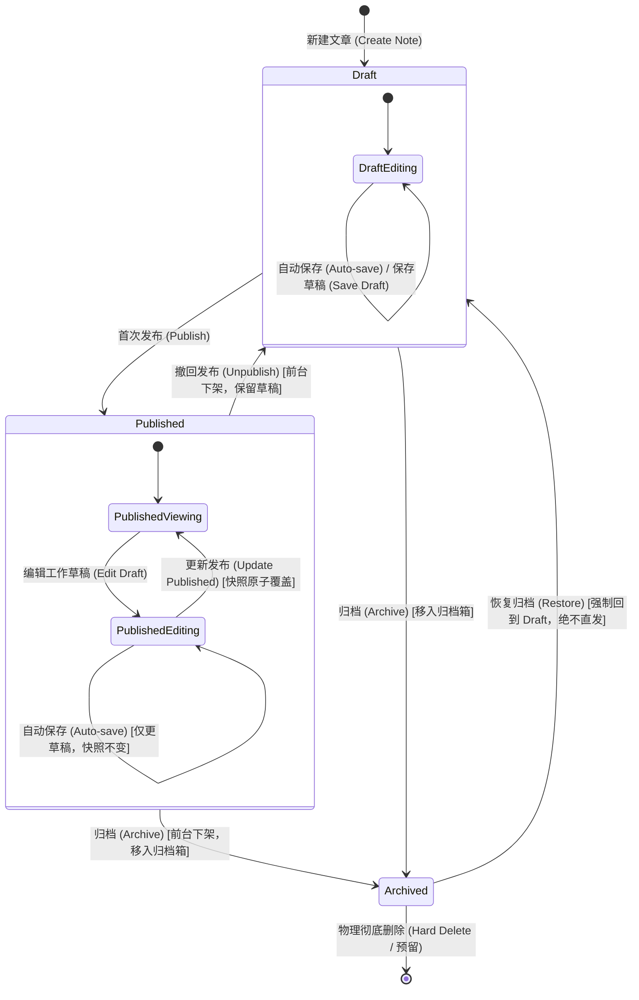
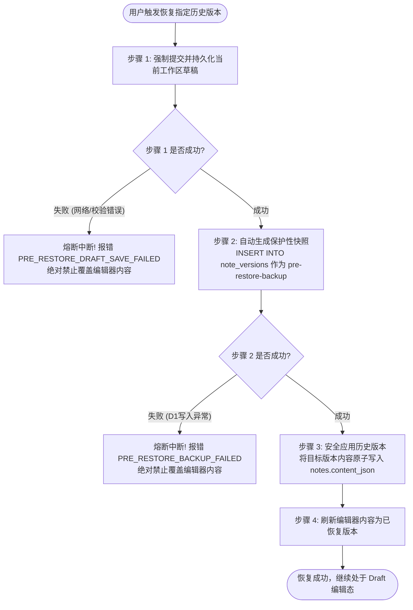
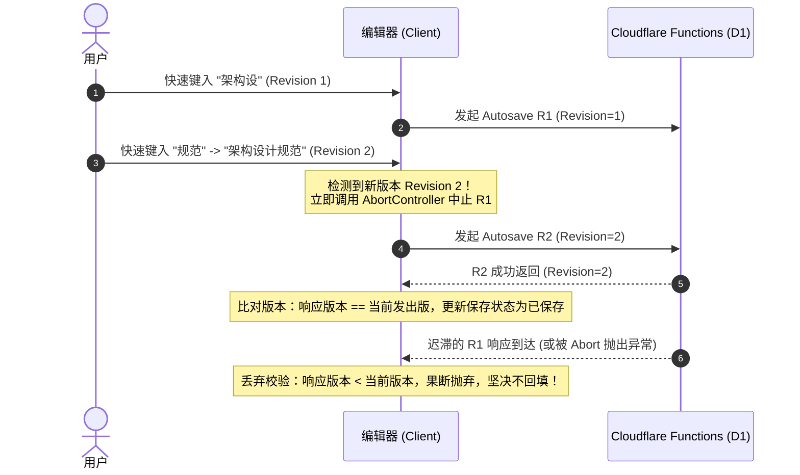

# 数据模型、API契约与状态流转设计规范

**文档标识**：`DOC-SPEC-DATA-API-2026-10-01`  
**负责角色**：数据与接口设计代理 (Role A)  
**目标版本**：v1.0.0 (Candidate for Freeze)  
**关联基线**：`docs/gemini-multi-agent-execution-plan-2026-10-01.md`, `docs/codex-master-spec.md`  
**适用范围**：Cloudflare D1 存储模型演进、Pages Functions 后端路由、共享契约类型、并发安全与前端缓存失效机制  

---

## 1. 架构总览与核心设计哲学

本规范旨在彻底解决个人博客与知识库重构中“编辑中草稿意外泄露给前台读者”、“文章生命周期状态混乱”、“历史版本恢复缺乏安全护栏”以及“并发自动保存时序错乱”四大核心隐患。

### 1.1 核心设计原则

1. **富文本编辑唯一源原则（Single Canonical Editable Source）**：
   - 数据库中的 `content_json` 永远是唯一的富文本编辑源（Canonical Editable Body）。
   - 无论是通过 Tiptap 可视化编辑器、Markdown 批量导入，还是历史版本恢复，所有编辑动作仅对 `content_json` 生效。
   - `content_text` 是由服务端基于当前 `content_json` 实时派生的纯文本，仅用于管理端快速搜索与字数摘要统计，严禁作为编辑源双向同步。
2. **发布快照隔离原则（Published Snapshot Isolation）**：
   - 读者在阅读区（`/posts/:slug`、首页文章流、分类/标签列表）访问时，**永远只读发布快照（Published Snapshot）**。
   - 创作者在后台对已发布文章进行的二次编辑、自动保存（Auto-save）和草稿保存（Save Draft），均局限在工作草稿层，在创作者显式触发“发布更新（Update Published）”之前，**绝不改变发布快照**，前台读者看到的永远是已冻结的发布内容。
3. **状态流转原子性原则（Atomic State Transitions）**：
   - 发布、撤回、归档等关键状态流转，必须在单个数据库原子操作/事务内完成，杜绝“状态更新成功但快照未写入”或“快照覆盖但状态未变”的半更新中间态。
4. **版本恢复熔断安全链原则（Fail-Safe Restore Circuit）**：
   - 历史版本（`note_versions`）仅作为只读回溯时光机，严禁直接覆盖正在编辑的工作草稿。
   - 恢复历史版本前，必须强制执行“当前工作草稿保存”与“生成保护性快照（Pre-restore Safety Version）”两道防线，任一步失败必须立即熔断中止，坚决保护创作者劳动成果。

---

## 2. 草稿与发布快照双层存储架构设计

### 2.1 存储架构选型与权衡分析

在 Cloudflare D1（基于 SQLite 引擎）的边缘计算环境下，实现“草稿与发布快照双层存储”有以下三种候选方案：

| 方案对比维度 | 方案 A：单表快照字段扩展（选定方案） | 方案 B：独立发布快照表 `published_notes` | 方案 C：复用 `note_versions` 打标 `is_published` |
| :--- | :--- | :--- | :--- |
| **存储形态** | 在 `notes` 表直接扩展 `published_*` 系列列 | 新建 `published_notes` 独立物理表 | 在 `note_versions` 增加 `is_published` 布尔标记 |
| **事务原子性** | **原生单行原子写入**，无跨表事务开销 | 需在 D1 Batch 中组合两条语句，存在部分失败回滚风险 | 需同时更新主表 status 与版本表标记 |
| **查询性能** | **极高**（单表直读，零 JOIN，边缘单次 I/O） | 较低（前台列表与详情需跨表联查或双向维护） | 差（前台查询需通过子查询或窗口函数筛选最新发布版本） |
| **外键与关系维护** | **零成本**（`note_tags`、`assets`、`roadmaps` 维持既有主外键） | 复杂（附件与标签需要处理两张表的主外键映射） | 复杂（附件与版本的归属关系易产生歧义） |
| **代码与契约迁移** | **平滑向下兼容**，已有 SQL 仅需追加字段投影 | 破坏性大，需大规模重构查询与写入通道 | 逻辑耦合严重，版本清理与发布生命周期相互污染 |

**决策结论**：采用 **方案 A（单表快照字段扩展）**。在边缘计算 D1 环境中，单表单行原子更新能够提供最高的可靠性、最优的读写吞吐，且能以最小的迁移代价无缝承接存量文章。

### 2.2 D1 SQLite Schema 演进规格

在现有 `notes` 表的基础上扩展 4 个发布快照字段，并建立复合条件索引：

```sql
-- 字段定义说明：
-- published_title: 发布时的标题快照（若文章从未发布则为 NULL）
-- published_summary: 发布时的摘要快照（若文章从未发布则为 NULL）
-- published_content_json: 发布时的富文本 Tiptap JSON 快照（读者阅读核心数据源）
-- published_content_text: 发布时的纯文本快照（供前台读者端搜索与字数估算）
-- published_at: 首次发布或最后一次更新发布的时间戳（ISO 8601 字符串）
```

#### 新增迁移脚本：`migrations/0003_add_published_snapshots.sql`

```sql
-- Migration: 0003_add_published_snapshots.sql
-- Description: 为 notes 表增加发布快照字段，支持草稿与发布双层解耦存储，并建立前台查询索引与存量回填

-- 1. 扩展发布快照字段
ALTER TABLE notes ADD COLUMN published_title TEXT;
ALTER TABLE notes ADD COLUMN published_summary TEXT;
ALTER TABLE notes ADD COLUMN published_content_json TEXT;
ALTER TABLE notes ADD COLUMN published_content_text TEXT;

-- 2. 建立前台高频读取组合索引（针对已发布文章按发布时间倒序排列）
CREATE INDEX IF NOT EXISTS idx_notes_published_lookup 
ON notes(status, published_at DESC);

-- 3. 存量已发布文章数据平滑回填（向后兼容核心）
-- 将目前 status = 'published' 的存量文章数据原子性填充至发布快照列，保证前台读者访问零中断
UPDATE notes
SET 
  published_title = title,
  published_summary = summary,
  published_content_json = content_json,
  published_content_text = content_text
WHERE status = 'published' AND published_content_json IS NULL;
```

---

## 3. 文章生命周期与状态流转契约

### 3.1 状态枚举定义

文章在系统中存在且仅存在以下三种互斥状态（`NoteStatus`）：
- `draft`（草稿）：未发布或已撤回发布的文章，仅后台管理可见，前台阅读区不可见。
- `published`（已发布）：已向读者公开发布的文章，前台阅读区通过发布快照正常渲染。
- `archived`（已归档）：下架并软删除的文章，前台阅读区不可见，后台默认列表隐藏，仅在“已归档”筛选页中可见。

### 3.2 状态机转换图 (Mermaid State Diagram)



### 3.3 详细操作行为与原子性契约表

| 操作名称 | 触发入口 | 允许的前提状态 | 目标状态 | 草稿层数据变动 (`title`, `content_json`, 等) | 发布快照层数据变动 (`published_*`) | `published_at` 变动 | 前台读者端展示效果 |
| :--- | :--- | :--- | :--- | :--- | :--- | :--- | :--- |
| **自动保存 (Auto-save)** | 编辑器输入防抖 (1500~2000ms) | Draft / Published | **保持原状态不变** | 更新草稿字段及 `updated_at` | **绝对不触碰，保持原快照** | 不变 | **完全无感**（若为 Published 仍看旧快照；若为 Draft 依然不可见） |
| **显式保存草稿 (Save Draft)** | 工具栏“保存”按钮 / `Ctrl+S` | Draft / Published | **保持原状态不变** | 更新草稿字段及 `updated_at`，返回成功信封 | **绝对不触碰，保持原快照** | 不变 | **完全无感**（仅提示后台“已保存至草稿”） |
| **首次发布 (Publish)** | 编辑器“发布”按钮 | Draft | `published` | 保持当前编辑态 | **全量原子复制**：草稿字段 $\to$ `published_*` | 设置为当前时间 `datetime('now')` | **立即在前台可见**，渲染全新快照 |
| **更新发布 (Update Published)** | 编辑器“更新发布”按钮 | Published | `published` | 保持当前编辑态 | **全量原子覆盖**：当前最新草稿 $\to$ `published_*` | 更新为当前时间（或记录最新发布时间戳） | **前台立即刷新**，展示最新修改内容 |
| **撤回发布 (Unpublish)** | 文章管理下拉“撤回发布” | Published | `draft` | 保持当前草稿不变 | 快照保留备查或置空；阅读接口通过 `status='draft'` 屏蔽 | 保留历史时间戳（仅作审计） | **前台立即下架**（访问 404），草稿箱可继续编辑 |
| **文章归档 (Archive)** | 文章管理“归档” / `DELETE` | Draft / Published | `archived` | 保持当前草稿不变 | 保持原样 | 不变 | **前台立即下架**，移出常规列表，放入“已归档”标签页 |
| **恢复归档 (Restore)** | 已归档列表“恢复”按钮 | Archived | **`draft`（强制）** | 保持当前草稿不变 | 保持原样 | 不变 | **前台依然不可见**，放入草稿箱待作者审阅确认 |

### 3.4 核心操作的执行边界与防错规则

1. **自动保存绝不越权**：
   - 自动保存动作必须使用 `PATCH /api/notes/:id`，且请求载荷中**严禁携带 `status` 变更**。
   - 自动保存**绝对不能生成 `note_versions` 记录**，避免数据库版本表膨胀。
2. **发布校验门禁**：
   - 触发 `Publish` 或 `Update Published` 前，后端必须强校验：
     * `title.trim().length > 0`
     * `content_json` 为符合约束的合法 Tiptap 文档
     * `slug` 必须合法且在系统中全局唯一（除自身已占有外不可冲突）
3. **归档恢复严禁直发**：
   - 归档文章执行 `Restore` 后的目标状态必须强制锁死为 `'draft'`。系统坚决禁止一键恢复并直接发布，以防止过时甚至已被废弃的旧内容意外泄漏至前台。

---

## 4. 历史版本快照 vs 发布快照的边界与安全恢复机制

### 4.1 边界隔离与定位区别

| 对比维度 | 发布快照 (`published_*` in `notes`) | 历史版本快照 (`note_versions` 表) |
| :--- | :--- | :--- |
| **服务对象** | **读者（Reader）** / 前台博客路由 | **作者（Author）** / 后台编辑器时光机 |
| **记录数量** | **仅有 1 份**（即当前正式发布的版本） | **多份**（按创建时间倒序排列的时光轨迹） |
| **创建时机** | 作者显式点击“发布”或“更新发布” | 1. 作者显式点击“保存版本”；<br>2. 系统在执行“恢复旧版本”前**自动创建保护快照** |
| **自动保存行为** | 绝不触发 | 绝不触发 |
| **数据形态** | 完整包含标题、摘要、富文本 JSON、纯文本 | 包含快照唯一 ID、文章 ID、富文本 JSON、纯文本、创建时间 |

### 4.2 历史版本恢复安全协议（Fail-Safe 熔断保护链）

当创作者在后台编辑器中选择恢复某一历史版本时，若直接将其覆盖至当前工作区，创作者正在键入的未保存内容或最近的草稿将产生不可逆的丢失。因此，必须通过如下“两阶段强制保护链”进行熔断防护：



#### 强约束安全法则：
1. **零丢失熔断原则**：
   - 步骤 1 与 步骤 2 只要有任意一步未返回 `HTTP 200/201` 成功 envelope，前端和后端必须立即中止恢复流程。
   - 此时编辑器不得替换当前内存文本，并弹出高危提示：“恢复前安全备份失败，为保护当前编辑内容，恢复操作已终止”。
2. **恢复范围隔离原则**：
   - 历史版本恢复**仅覆盖工作草稿（`content_json`, `content_text`）**，**严禁同时更新 `published_*` 发布快照**！
   - 恢复后文章依然保持原有的发布/草稿状态。若文章本处于 Published 状态，前台读者看到的依然是旧发布快照，直到作者检查恢复后的草稿确认无误，并显式点击“更新发布”后，新草稿才会推向前台。

---

## 5. API 路由契约与并发安全设计

### 5.1 统一 API Envelope 与错误处理规范

所有 API 严格遵循项目既定信封格式：

#### 成功响应 (HTTP 200 / 201)
```json
{
  "success": true,
  "data": { ... }
}
```

#### 失败响应 (HTTP 4xx / 5xx)
```json
{
  "success": false,
  "error": {
    "code": "STABLE_MACHINE_CODE",
    "message": "人类可读的明确错误提示"
  }
}
```

#### 标准机器错误码清单
- `VALIDATION_ERROR` (HTTP 400)：入参格式、JSON 结构或字段合法性校验失败。
- `UNAUTHORIZED` (HTTP 401)：未通过 Cloudflare Access 鉴权。
- `FORBIDDEN` (HTTP 403)：无权执行该操作。
- `NOTE_NOT_FOUND` (HTTP 404)：目标文章 ID 不存在。
- `SLUG_CONFLICT` (HTTP 409)：所指定的 Slug 已被其他文章占用。
- `STALE_REVISION_REJECTED` (HTTP 409)：提交的修订版本已过期（时序冲突拦截）。
- `PRE_RESTORE_BACKUP_FAILED` (HTTP 500 / 409)：版本恢复前保护快照创建失败。
- `NOTE_REPOSITORY_FAILURE` (HTTP 500)：底层 D1 数据库执行故障。

---

### 5.2 核心业务 API 路由契约规格

#### 1. 发布文章 / 更新发布：`POST /api/notes/:id/publish`
- **语义**：将指定文章的当前草稿全量原子性提升为发布快照，并将状态置为 `published`。
- **请求方法**：`POST`
- **请求头**：`Content-Type: application/json`
- **请求体 (Request Body)**：
```json
{
  "expectedUpdatedAt": "2026-10-01T12:00:00.000Z" // 可选，并发版本校验字段
}
```
- **成功响应 (HTTP 200)**：
```json
{
  "success": true,
  "data": {
    "id": "c1f7a83d-e6b2-4d2a-8c54-97216a9a7b51",
    "title": "深入现代前端架构",
    "slug": "deep-dive-modern-frontend",
    "summary": "解析端到端渲染与离线缓存策略",
    "contentJson": "{\"type\":\"doc\",\"content\":[...]}",
    "contentText": "解析端到端渲染与离线缓存策略...",
    "publishedTitle": "深入现代前端架构",
    "publishedSummary": "解析端到端渲染与离线缓存策略",
    "publishedContentJson": "{\"type\":\"doc\",\"content\":[...]}",
    "publishedContentText": "解析端到端渲染与离线缓存策略...",
    "category": "Architecture",
    "status": "published",
    "isPinned": false,
    "isFeatured": true,
    "publishedAt": "2026-10-01T12:05:00.000Z",
    "createdAt": "2026-09-30T10:00:00.000Z",
    "updatedAt": "2026-10-01T12:05:00.000Z",
    "lastReviewedAt": null,
    "reviewCount": 0
  }
}
```
- **D1 执行事务逻辑**：
```sql
UPDATE notes SET
  published_title = title,
  published_summary = summary,
  published_content_json = content_json,
  published_content_text = content_text,
  status = 'published',
  published_at = datetime('now'),
  updated_at = datetime('now')
WHERE id = ?;
```

---

#### 2. 撤回发布：`POST /api/notes/:id/unpublish`
- **语义**：将已发布文章撤回为草稿，前台阅读端立时下架，工作草稿保持不变。
- **请求方法**：`POST`
- **请求体**：`{}`
- **成功响应 (HTTP 200)**：返回更新后的 `NoteRecord`，其中 `status` 变为 `'draft'`。
- **D1 执行 SQL**：
```sql
UPDATE notes SET
  status = 'draft',
  updated_at = datetime('now')
WHERE id = ? AND status = 'published';
```

---

#### 3. 归档文章：`POST /api/notes/:id/archive` (或 `DELETE /api/notes/:id`)
- **语义**：软删除归档文章。
- **请求方法**：`POST` / `DELETE`
- **请求体**：`{}`
- **成功响应 (HTTP 200)**：返回更新后的 `NoteRecord`，其中 `status` 变为 `'archived'`。
- **D1 执行 SQL**：
```sql
UPDATE notes SET
  status = 'archived',
  updated_at = datetime('now')
WHERE id = ?;
```

---

#### 4. 恢复归档文章：`POST /api/notes/:id/restore`
- **语义**：将归档文章恢复为草稿状态。
- **请求方法**：`POST`
- **请求体**：`{}`
- **强约束规则**：无论归档前是 published 还是 draft，恢复后**一律写入 `status = 'draft'`**。
- **成功响应 (HTTP 200)**：返回更新后的 `NoteRecord`，其中 `status = 'draft'`。
- **D1 执行 SQL**：
```sql
UPDATE notes SET
  status = 'draft',
  updated_at = datetime('now')
WHERE id = ? AND status = 'archived';
```

---

#### 5. 安全恢复历史版本：`POST /api/notes/:id/restore-version`
- **语义**：执行带保护性快照熔断的安全版本恢复。
- **请求方法**：`POST`
- **请求体 (Request Body)**：
```json
{
  "versionId": "v-7b9e-4c21-9a10-2f1d8c",
  "currentDraft": {
    "contentJson": "{\"type\":\"doc\",\"content\":[...]}",
    "contentText": "当前正在编辑的文字..."
  }
}
```
- **后端执行管道**：
  1. 验证目标版本 `versionId` 存在且隶属于 `note_id = :id`。
  2. 生成保护快照：使用当前草稿数据插入一条记录到 `note_versions` 表：
     ```sql
     INSERT INTO note_versions (id, note_id, content_json, content_text, created_at)
     VALUES (?, ?, :currentContentJson, :currentContentText, datetime('now'));
     ```
  3. 执行覆盖草稿：
     ```sql
     UPDATE notes SET
       content_json = :targetVersionContentJson,
       content_text = :targetVersionContentText,
       updated_at = datetime('now')
     WHERE id = ?;
     ```
- **成功响应 (HTTP 200)**：返回最新 `NoteRecord`，编辑器重新载入内容。

---

#### 6. 保存草稿 / 自动保存：`PATCH /api/notes/:id`
- **语义**：增量保存编辑中的草稿内容。
- **并发与时钟保护请求体**：
```json
{
  "title": "修改后的标题",
  "contentJson": "{\"type\":\"doc\",\"content\":[...]}",
  "summary": "更新后的摘要",
  "lastKnownUpdatedAt": "2026-10-01T12:00:00.000Z" // 可选客户端时戳防乱序
}
```
- **后端处理铁律**：严禁更新任何 `published_*` 字段；严禁自动创建 `note_versions` 记录；若请求中未指定 `status` 则维持原样。

---

### 5.3 阅读端 API 投影规范与安全隔离

前台读者区（包括静态回退、动态博客列表、按 Slug 读取文章）通过 API 查询文章时，必须遵循以下查询投影契约：

#### 1. 读者端列表查询（前台文章同步）
- **请求示例**：`GET /api/notes?status=published&pageSize=100`
- **服务端必须增加的 SQL 过滤条件**：
```sql
SELECT 
  id,
  slug,
  COALESCE(published_title, title) AS title,
  COALESCE(published_summary, summary) AS summary,
  published_content_json AS content_json,
  published_content_text AS content_text,
  category,
  status,
  is_pinned,
  is_featured,
  published_at,
  created_at,
  updated_at
FROM notes
WHERE status = 'published' AND published_content_json IS NOT NULL
ORDER BY is_pinned DESC, published_at DESC
LIMIT ? OFFSET ?;
```

#### 2. 读者端按 Slug 详情读取
- **请求示例**：`GET /api/notes?status=published&slug=my-awesome-post`
- **安全过滤与投影要求**：
  * 若文章处于 `draft` 或 `archived` 状态，返回空结果集或 404 Not Found。
  * 响应中的 `title`, `summary`, `content_json`, `content_text` 必须优先且强制投影自 `published_*` 列。
  * 杜绝将后台正在输入保存的未发布草稿泄露给前台读者。

---

### 5.4 并发与时序安全设计（Stale Autosave Rejection）

#### 痛点场景：高频输入下的竞态条件
用户在编辑器连续快速键入时，防抖触发了保存请求 $R_1$（文本为 "架构设"）。由于移动网络波动或边缘延迟，$R_1$ 尚未返回，用户又键入了 "架构设计规范"，防抖触发请求 $R_2$。若 $R_2$ 先于 $R_1$ 完成，$R_1$ 迟滞返回，如果不加防护，前端将误用 $R_1$ 的旧状态覆盖本地最新文本，导致光标跳变或内容吞字。

#### 解决方案：三层防竞态机制



1. **请求取消机制（Abort Controller）**：
   - 前端维护当前活跃保存请求的 `AbortController`。
   - 当新的保存（无论是手动还是自动）被调度触发时，立刻调用前一个未决请求的 `abort()`，通知底层网络栈取消传输。
2. **单调递增版本号 / 修订时间戳校验（Revision Monotonicity）**：
   - 客户端在编辑器生命周期内维护自增的 `clientRevisionId: number`。
   - 发起保存请求时记录 `requestRevision = ++clientRevisionId`。
   - 当 API 响应返回时，比对响应中的 revision 标记与当前编辑器最新的 `clientRevisionId`。若 `responseRevision < clientRevisionId`，视为**过期旧响应（Stale Response）**，直接丢弃其数据回填逻辑。
3. **离开页面与并发保护（Unsaved Guard）**：
   - 若当前有保存处于 in-flight 状态，或本地草稿存在 dirty 标记，浏览器触发 `beforeunload` 与前端 React Router 导航拦截保护，防止保存未落盘时丢失修改。

---

### 5.5 动态缓存失效机制（Dynamic Cache Invalidation）

前端 `apps/web/src/content/dynamicContentSync.ts` 维护了用于平滑浏览的动态文章内存缓存（`syncPromise` 及 5 秒节流阀 `lastSyncTimestamp`）。

#### 缓存失效触发矩阵：
当后台管理端成功执行以下任意一项变更时，必须在客户端立即触发 `invalidateDynamicContent()`：

| 触发操作 | 必须执行的缓存动作 | 预期效果 |
| :--- | :--- | :--- |
| **首次发布 (Publish)** | `invalidateDynamicContent()` + `syncPublishedNotes(true)` | 前台首页、文章流及标签页立即显示新文章 |
| **更新发布 (Update Published)** | `invalidateDynamicContent()` + `syncPublishedNotes(true)` | 前台读者阅读页立即载入最新发布快照 |
| **撤回发布 (Unpublish)** | `invalidateDynamicContent()` + `clearDynamicPosts()` | 前台读者端立即无法访问该文章，文章流移除 |
| **归档文章 (Archive)** | `invalidateDynamicContent()` + `syncPublishedNotes(true)` | 前台读者端立即下架该文章 |
| **恢复归档 (Restore)** | `invalidateDynamicContent()` | 无前台影响（恢复后依然为 draft），重置同步状态 |
| **修改文章 Slug** | `invalidateDynamicContent()` + `syncPublishedNotes(true)` | 旧 Slug 失效，新 Slug 立刻生效 |

#### HTTP 响应头防边缘强缓存策略：
- Pages Functions 对 `/api/notes*`、`/api/search*`、`/api/stats` 统一注入标准防缓存响应头：
  ```http
  Cache-Control: private, no-cache, no-store, must-revalidate
  Pragma: no-cache
  Expires: 0
  ```
- 确保 Cloudflare Edge CDN 不会缓存动态文章的 API 响应，保证发布/撤回动作毫秒级全球即时生效。

---

## 6. 共享类型定义规格 (`packages/shared/src/knowledge.ts`)

为了确保后端与前端类型契约严丝合缝，定义如下核心类型扩展：

```typescript
// 1. 文章状态类型（保持稳定）
export const noteStatuses = ['draft', 'published', 'archived'] as const;
export type NoteStatus = (typeof noteStatuses)[number];

// 2. 核心文章数据记录（NoteRecord）扩展发布快照字段
export type NoteRecord = {
  id: string;
  title: string;
  slug: string;
  summary: string;
  contentJson: string;
  contentText: string;
  
  // 新增发布快照字段（可为空，仅在发布过时存在）
  publishedTitle?: string | null;
  publishedSummary?: string | null;
  publishedContentJson?: string | null;
  publishedContentText?: string | null;

  category: string;
  status: NoteStatus;
  isPinned: boolean;
  isFeatured?: boolean;
  publishedAt?: string | null;
  tags?: readonly string[];
  reviewCount: number;
  createdAt: string;
  updatedAt: string;
  lastReviewedAt: string | null;
};

// 3. 发布与恢复请求/响应契约
export type PublishNoteRequest = {
  expectedUpdatedAt?: string;
};

export type RestoreVersionRequest = {
  versionId: string;
  currentDraft?: {
    contentJson: string;
    contentText?: string;
  };
};

// 4. API 路由契约映射表扩展
export type KnowledgeApiRouteAdditions = {
  'POST /api/notes/:id/publish': {
    request: PublishNoteRequest;
    response: NoteRecord;
  };
  'POST /api/notes/:id/unpublish': {
    request: EmptyResponse;
    response: NoteRecord;
  };
  'POST /api/notes/:id/archive': {
    request: EmptyResponse;
    response: NoteRecord;
  };
  'POST /api/notes/:id/restore': {
    request: EmptyResponse;
    response: NoteRecord;
  };
  'POST /api/notes/:id/restore-version': {
    request: RestoreVersionRequest;
    response: NoteRecord;
  };
};
```

---

## 7. 数据回填与向下兼容迁移方案

### 7.1 存量数据平滑迁移原则
1. **零停机平滑过度**：执行 `migrations/0003_add_published_snapshots.sql` 时，DDL 追加列默认为 NULL，不阻塞生产查询。
2. **存量已发布文章无缝衔接**：通过迁移脚本中的 `UPDATE notes SET published_... = ... WHERE status = 'published'` 语句，一次性将目前生产 D1 中已标记为 `published` 的文章数据写入快照。
3. **Draft 与 Archived 数据绝对隔离**：未发布的草稿和已归档记录，其 `published_*` 保持为 NULL，绝对不会在迁移过程中被误发布。

### 7.2 回滚与异常防御预案 (Defensive Rollback)

#### 1. 迁移执行前置要求：
- 在本地开发环境验证迁移脚本幂等性：
  ```bash
  wrangler d1 migrations apply DB --local
  ```
- 验证回填结果：
  ```sql
  SELECT id, title, published_title, status FROM notes WHERE status = 'published';
  ```
- 检查是否存在 `status = 'published'` 但 `published_content_json IS NULL` 的脏数据。

#### 2. 代码级优雅防御（Fallback in Code）：
在 API 与前端映射逻辑中提供保底降级：
```typescript
// 位于 apps/web/src/content/dynamicContentSync.ts 或后端投影
export function noteToPost(note: NoteRecord): Post {
  // 核心：优先使用发布快照，若存量脏数据快照为空，优雅回退至草稿（仅限 published 状态）
  const title = note.publishedTitle ?? note.title;
  const summary = note.publishedSummary ?? note.summary;
  const contentJsonRaw = note.publishedContentJson ?? note.contentJson;
  const contentText = note.publishedContentText ?? note.contentText;
  
  // ... 正常解析并组装 Post 对象
}
```

#### 3. 故障回滚方案（Rollback SQL）：
若迁移出现严重意外需回滚，由于 SQLite 3.35.0+ 支持 `ALTER TABLE DROP COLUMN`（D1 已支持）：
```sql
-- 回滚 SQL (仅在灾难恢复时由管理员手动执行)
DROP INDEX IF EXISTS idx_notes_published_lookup;
ALTER TABLE notes DROP COLUMN published_title;
ALTER TABLE notes DROP COLUMN published_summary;
ALTER TABLE notes DROP COLUMN published_content_json;
ALTER TABLE notes DROP COLUMN published_content_text;
```

---

## 8. 验收用例与测试断言矩阵

本规范覆盖并对齐 `docs/gemini-multi-agent-execution-plan-2026-10-01.md` 中的关键验收用例：

| 验收用例 ID | 场景描述 | 操作步骤与数据前置 | 预期结果与断言标准 (Pass Criteria) |
| :--- | :--- | :--- | :--- |
| **PUB-01** | 修改已发布文章，等待自动保存 | 1. 打开一篇已发布状态的文章；<br>2. 修改正文内容并等待 2000ms 触发自动保存；<br>3. 另开隐私窗口以读者身份访问该文章。 | 1. 接口确认 `notes.content_json` 已更新；<br>2. `notes.published_content_json` **保持不变**；<br>3. 读者端看到的仍是**修改前的旧版本**。 |
| **PUB-02** | 明确更新发布 | 1. 接 PUB-01 状态，在编辑器点击“更新发布”；<br>2. 刷新读者端页面。 | 1. `POST /api/notes/:id/publish` 返回成功；<br>2. 快照字段原子覆盖为最新草稿内容；<br>3. 读者端立即呈现最新编辑内容。 |
| **PUB-03** | 撤回与归档后访问旧链接 | 1. 对一篇已发布文章点击“撤回发布”或“归档”；<br>2. 读者端访问该文章 Slug。 | 1. 状态变为 `draft` 或 `archived`；<br>2. 前端缓存立即清除；<br>3. 读者端访问返回 404，旧缓存不泄露。 |
| **PUB-04** | 恢复归档文章 | 1. 在归档列表中选中某篇此前曾发布过的文章；<br>2. 点击“恢复”。 | 1. 接口返回 `status = 'draft'`；<br>2. **绝不能直接变为 published**；<br>3. 读者端依然不可见。 |
| **VER-01** | 恢复版本时保护快照失败 | 1. 模拟 D1 故障使保护性快照插入失败；<br>2. 发起历史版本恢复。 | 1. 恢复流程立即熔断中断；<br>2. 抛出 `PRE_RESTORE_BACKUP_FAILED`；<br>3. 当前编辑器草稿内容**完好无损，未被覆盖**。 |
| **VER-02** | 成功恢复旧版本 | 1. 恢复指定历史版本；<br>2. 检查草稿与快照。 | 1. 自动生成了一份恢复前保护版本；<br>2. 草稿更新为历史版本；<br>3. **发布快照保持不变**；<br>4. 普通自动保存不额外生成版本快照。 |
| **EDIT-02** | 保存期间继续输入 | 1. 弱网环境下触发保存；<br>2. 在保存网络请求响应前继续高速输入文字。 | 1. 迟滞返回的旧响应被客户端版本校验丢弃；<br>2. 不发生光标跳动与新文字被旧响应覆盖。 |
| **DATA-01** | 存量数据向下兼容迁移 | 1. 应用迁移脚本 `0003_add_published_snapshots.sql`；<br>2. 检查存量已发布文章。 | 1. 存量已发布文章的 `published_*` 成功从旧草稿回填；<br>2. 读者端访问原有 Slug 体验无缝衔接。 |

---

## 9. 代理协作分工与下游执行指引

本规范冻结后，各下游角色的执行边界如下：
- **Role B (后端实现)**：
  - 创建并验证 `migrations/0003_add_published_snapshots.sql`。
  - 在 `functions/lib/notes.ts` 与 `functions/api/notes/[[path]].ts` 中实现原子发布、撤回、归档、恢复及两阶段版本恢复管道。
  - 严格实现前台 reader 投影查询（`WHERE status = 'published' AND published_content_json IS NOT NULL`）。
- **Role E (编辑器实现)**：
  - 实现双层保存交互：将“自动保存/保存草稿”（仅更草稿）与“发布/更新发布”（原子推快照）明确区分。
  - 实现版本恢复前的客户端两步保护调用链。
  - 实现 Stale Autosave Rejection 丢弃逻辑与 `AbortController` 机制。
- **Role M (管理界面实现)**：
  - 在文章列表中展示 Draft / Published / Archived 标签。
  - 标识“有未发布的草稿修改”指示标记（`contentJson !== publishedContentJson`）。
- **Role N (阅读导航与前台实现)**：
  - 对接 `dynamicContentSync.ts`，确保 `noteToPost` 严格消费 `published_*` 快照。
- **Role Q / R (规格与安全审查)**：
  - 对照本规范第 8 节的验收用例矩阵，逐项核验代码实现与测试证据。
